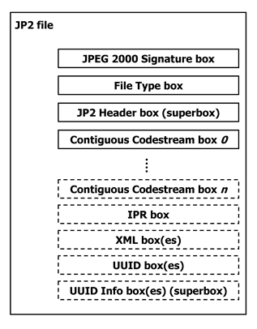
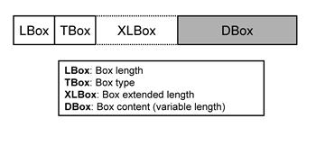
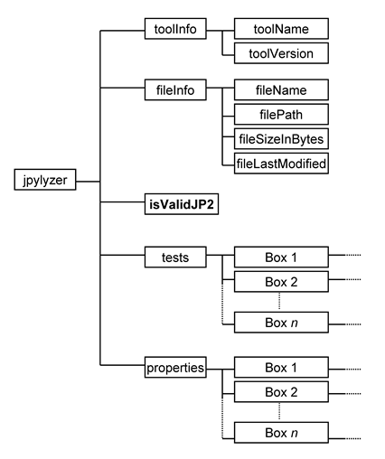
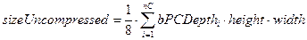
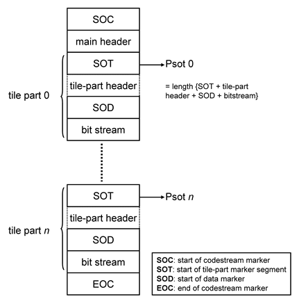
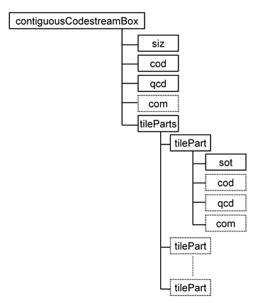

  

jpylyzer: validator and properties extractor for JPEG 2000 Part 1 (JP2)

User Manual

jpylyzer version: 1.13

KB/ National Library of the Netherlands

Open Planets Foundation

This work was partially supported by the SCAPE Project. The SCAPE project is
co-funded by the European Union under FP7 ICT-2009.4.1 (Grant Agreement
number 270137).

Disclaimer

Both the program code and this manual have been carefully inspected
before printing. However, no warranties, either expressed or implied,
are made concerning the accuracy, completeness, reliability, usability,
performance, or fitness for any particular purpose of the information
contained in this manual, to the software described in this manual, and
to other material supplied in connection therewith. The material is
provided "as is". The entire risk as to its quality and performance is
with the user.

  
Introduction {#introduction}
==============

About jpylyzer {#about-jpylyzer}
------------------

This User Manual documents *jpylyzer*, a validator and feature extractor
for JP2 images. JP2 is the still image format that is defined by JPEG
2000 Part 1 (ISO/IEC 15444-1). *Jpylyzer* was specifically created to
answer the following questions that you might have about any JP2 file:

1. Is this really a JP2 and does it really conform to the format's
specifications (validation)?

2. What are the technical characteristics of this image (feature
extraction)?

Validation: scope and restrictions {#validation-scope-and-restrictions}
--------------------------------------

Since the word ‘validation’ means different things to different people,
a few words about the overall scope of *jpylyzer*. First of all, it is
important to stress that *jpylyzer* is not a ‘one stop solution’ that
will tell you that an image is 100% perfect. What *jpylyzer* does is
this: based on the JP2 format specification (ISO/IEC 15444-1), it parses
a file. It then subjects the file’s contents to a large number of tests,
each of which is based on the requirements and restrictions that are
defined by the standard. If a file fails one or more tests, this implies
that it does not conform to the standard, and is no valid JP2.
Importantly, this presumes that *jpylyzer*’s tests accurately reflect
the format specification, without producing false positives.

### ‘Valid’ means ‘probably valid’

If a file passes all tests, this is an indication that it is *probably*
valid JP2. This (intentionally) implies a certain degree of remaining
uncertainty, which is related to the following.

First of all, *jpylyzer* (or any other format validator for that matter)
‘validates’ a file by trying to prove that it does *not* conform to the
standard. It cannot prove that that a file *does* conform to the
standard.

Related to this, even though *jpylyzer*’s validation process is very
comprehensive, it is not complete. For instance, the validation of JPEG
2000 codestreams at this moment is still somewhat limited. Section 7.2
discusses these limitations in detail. Some of these limitations (e.g.
optional codestream segment markers that are only minimally supported at
this stage) may be taken away in upcoming versions of the tool.

### No check on compressed bitstreams

One important limitation that most certainly will *not* be addressed in
any upcoming versions is that *jpylyzer* does not analyse the data in
the compressed bitstream segments. Doing so would involve decoding the
whole image, and this is completely out of *jpylyzer*’s scope. As a
result, it is possible that a JP2 that passes each of *jpylyzer*’s tests
will nevertheless fail to render correctly in a viewer application.

### Recommendations for use in quality assurance workflows

Because of the foregoing, a thorough JP2 quality assurance workflow
should not rely on *jpylyzer* (or any other format validator) alone, but
it should include other tests as well. Some obvious examples are:

* A rendering test that checks if a file renders at all

* Format migration workflows (e.g. TIFF to JP2) should ideally also
include some comparison between source and destination images (e.g. a
pixel-wise comparison)

Conversely, an image that successfully passes a rendering test or
pixel-wise comparison may still contain problematic features (e.g.
incorrect colour space information), so validation, rendering tests and
pixel-wise comparisons are really complementary to each other.

### Note on ICC profile support

At the time of writing an amendment is in preparation that will extend
the support for embedded ICC profiles in JP2. *Jpylyzer* is already
anticipating these changes, and as a result there is a minor discrepancy
here between *jpylyzer* and the current standard text.

Outline of this User Manual {#outline}
-------------------------------

Chapter 2 describes the installation process of *jpylyzer* for Windows
and Unix-based systems. Chapter 3 explains the usage of *jpylyzer* as a
command-line tool, or as an importable Python module. Chapter 4 gives a
brief overview of the structure of JP2 and its ‘box’ structure.
*Jpylyzer*’s output format is explained in chapter 5. The final chapters
give a detailed description of the tests that *jpylyzer* performs for
validation, and its reported properties. Chapter 6 does this for all
‘boxes’, except for the ‘Contiguous Codestream’ box, which is given a
chapter (7) of its own.

Funding {#funding}
-----------

The development of *jpylyzer* was funded by the EU FP 7 project SCAPE
(SCAlabable Preservation Environments). More information about this
project can be found here:

[http://www.scape-project.eu/](http://www.scape-project.eu/)

License {#license}
-----------

*Jpylyzer* is free software: you can redistribute it and/or modify it
under the terms of the GNU Lesser General Public License as published by
the Free Software Foundation, either version 3 of the License, or (at
your option) any later version. This program is distributed in the hope
that it will be useful, but WITHOUT ANY WARRANTY; without even the
implied warranty of MERCHANTABILITY or FITNESS FOR A PARTICULAR PURPOSE.
See the GNU Lesser General Public License for more details. You should
have received a copy of the GNU Lesser General Public License along with
this program. If not, see:

[http://www.gnu.org/licenses/](http://www.gnu.org/licenses/)

On Debian systems, the complete text of the GNU Lesser General Public
License version 3 can be found in:

    /usr/share/common-licenses/LGPL-3

Installation and set-up {#installation}
=========================

Obtaining the software {#obtaining-the-software}
--------------------------

To obtain the latest version of the software please use the download
links at the *jpylyzer* homepage:

[http://openplanets.github.io/jpylyzer/](http://openplanets.github.io/jpylyzer/)

You have three options:

1. Use the Python source code. This allows you to run the software as a
Python script on most popular platforms (Windows, Linux, Mac, etc.).
However, this requires that you have a recent version of the Python
interpreter available on your system.

2. Alternatively, for Windows users there is also a set of stand-alone
binaries[^1]. These allow you to run *jpylyzer* as an
executable Windows application, without any need for installing Python.
This option is particularly useful for Windows users who cannot (or
don’t want to) install software on their system.

3. For Linux users Debian packages are available. These allow you to run
*jpylyzer* without any need for installing Python.

These options are described in the following sections.

Installation of Python script (Linux/Unix, Windows, Mac OS X) {#installation-python}
-----------------------------------------------------------------

First, download the source files using one of the ‘Source Code
Downloads’ links on the OPF *jpylyzer* page.

Then unzip the contents of the ZIP file to an empty directory. If you
are working on a Linux/Unix based system you may need to make the
scripts executable, and convert any line breaks to Unix-style ones. To
do this, use the following commands:

    chmod 755 *.py
    dos2unix *.py

In order to run the script you will need either Python 2.7, or Python
3.2 (or more recent)[^2]. Python can be downloaded from:

[http://python.org/](http://python.org/)

### Testing the installation

To test your installation, open a console window (or command prompt) and
type:

    %jpylyzerPath%/jpylyzer.py -h

In the above command, replace *%jpylyzerPath%* with the full path to the
*jpylyzer* installation directory (i.e. the directory that contains
‘jpylyzer.py’ and its associated files). For example, if you extracted
the files to directory ‘/home/jpylyzer’, the command would become:

    /home/jpylyzer/jpylyzer.py -h

Executing this command should result in the following screen output:

    usage: jpylyzer.py [-h] [--verbose] [--wrapper] [--version] ...

    JP2 image validator and properties extractor

    [...]

### Troubleshooting

If the above test didn’t run successfully, first verify the following
possible causes:

* On Windows: check if files with a *.py* extension are associated with
the Python interpreter. If you have multiple versions of Python on your
system, make sure that the association does not link to a Python version
that is incompatible with *jpylyzer* (e.g. Python 2.6 or older, or
Python 3.0/3.1).

* On Unix/Linux: by default, *jpylyzer* uses the command interpreter
that is defined by the ‘python’ environment variable. If this is linked
to some (very) old version of Python, things may not work as expected.
If you run into problems because of this, update the command interpreter
references in *jpylyzer.py*, i.e. change:

<pre>#! /usr/bin/env python</pre>

into:

<pre>#! /usr/bin/env python27</pre>

Installation of Windows binaries (Windows only) {#installation-windows}
---------------------------------------------------

Download the binary using the link on the *jpylyzer* homepage. Unzip the
contents of this file to an empty folder on your PC. *Jpylyzer* should
now be ready for use.

### Testing the installation

To test your installation, open a Command Prompt (‘DOS prompt’) and
type:

    %jpylyzerPath%\jpylyzer -h

In the above command, replace *%jpylyzerPath%* with the full path to the
*jpylyzer* installation directory (i.e. the directory that contains
‘jpylyzer.exe’ and its associated files). For example, if you extracted
the files to directory `c:\tools\jpylyzer`, the command would become:

    c:\tools\jpylyzer\jpylyzer -h

Executing this command should result in the following screen output:

    usage: jpylyzer.exe [-h] [--verbose] [--wrapper] [--version] ...

    JP2 image validator and properties extractor

    [...]

### Running jpylyzer without typing the full path

Optionally, you may also want to add the full path of the *jpylyzer*
installation directory to the Windows ’Path’ environment variable. Doing
so allows you to run *jpylyzer* from any directory on your PC without
having to type the full path. In Windows 7 you can do this by selecting
‘settings’ from the ‘Start’ menu; then go to ‘control panel’/’system’
and go to the ‘advanced’ tab. Click on the ‘environment variables’
button. Finally, locate the ‘Path’ variable in the ‘system variables’
window, click on ‘Edit’ and add the full *jpylyzer* path (this requires
local Administrator privileges). The settings take effect on any newly
opened command prompt.

Installation of Debian packages (Ubuntu/Linux) {#installation-debian}
--------------------------------------------------

For a number of Linux architectures Debian packages of *jpylyzer* exist.
To install, simply download the *.deb* file, double-click on it and
select *Install Package*. Alternatively you can also do this in the
command terminal by typing:

    sudo dpkg -i jpylyzer_1.13.0_i386.deb

In both cases you need to have administrative privileges.

Using *jpylyzer* {#using-jpylyzer}
==================

Overview {#using-overview}
------------

This chapter describes the general use of *jpylyzer*. The first sections
cover the use of *jpylyzer* as a command-line tool and as an importable
Python module.

Command-line usage {#command-line-usage}
----------------------

This section explains *jpylyzer*’s general command-line interface. For
the sake of brevity, all command-line examples assume the use of the
Python script; moreover, full paths are omitted. This means that,
depending on your system and settings, you may have to substitute each
occurrence of ‘jpylyzer.py’ with its full path, the corresponding
Windows binary, or a combination of both. The following examples
illustrate this:

|This User Manual|jpylyzer.py|
|:---------------|:----------|
|Substitution example Linux|`/home/jpylyzer/jpylyzer.py`|
|Substitution example Windows binaries|`c:\tools\jpylyzer\jpylyzer`|

Furthermore, command line arguments that are given between square
brackets (example: `[-h]`) are optional.

### Synopsis

*Jpylyzer* can be invoked using the following command-line arguments:

    jpylyzer.py [-h] [--verbose] [--wrapper] [--version]
         [--nullxml] [--nopretty] ...

With:

...
: input JP2 image(s)

[-h, --help]
: show help message and exit

[--verbose]
: report test results in verbose format

[--wrapper, -w]
: wraps the output for individual image(s) in 'results' XML element

[--nullxml]
: extract null-terminated XML content from XML and UUID boxes(doesn't affect validation)

[--nopretty]
: suppress pretty-printing of XML output

[-v, --version]
: show program's version number and exit

Note that the input can either be a single image, a space-separated
sequence of images, a pathname expression that includes multiple images,
or any combination of the above. For example, the following command will
process one single image:

    jpylyzer.py rubbish.jp2

The next example shows how to process all files with a ‘jp2’ extension
in the current directory:

    jpylyzer.py *.jp2

Note that on Unix/Linux based systems pathname expressions may not work
properly unless you wrap them in quotation marks:

    jpylyzer.py "*.jp2"

### Output redirection

All output (except warning and system error messages) is directed to the
standard output device (stdout). By default this is the console screen.
Use your platform’s standard output redirection operators to redirect
output to a file. The most common situation will be to redirect the
output of one invocation of *jpylyzer* to an XML file, which can be done
with the ‘\>’ operator (both under Windows and Linux):

    jpylyzer.py jp2In > outputFile

E.g. the following command will run *jpylyzer* on image ‘rubbish.jp2’ and
redirects the output to file ‘rubbish.xml’:

    jpylyzer.py rubbish.jp2 > rubbish.xml

The format of the XML output is described in Chapter 5.

### Creating well-formed XML with multiple images

By default, *jpylyzer* creates a separate XML tree for each analysed
image, without any overarching hierarchy. If you use a pathname
expression to process multiple images and redirect the output to a file,
the resulting file will **not** be a well-formed XML document. An
example:

    jpylyzer.py rubbish.jp2 garbage.jp2 > rubbish.xml

In this case, the output for these 2 images is redirected to
‘rubbish.xml’, but the file will be a succession of two XML trees, which
by itself is not well-formed XML. Use the *--wrapper* option if you want
to create well-formed XML instead:

    jpylyzer.py --wrapper rubbish.jp2 garbage.jp2 > rubbish.xml

In the above case the XML trees of the individual images are wrapped
inside a ‘results’ element.

### ‘nullxml’ option

The *nullxml* option was added to enable extraction of XML content that
is terminated by a null-byte. By default *jpylyzer* doesn’t report the
XML in that case, because it throws an exception in the XML parser.
Apparently some old versions of the Kakadu demo applications would
erroneously add a null-byte to embedded XML, so this option can be used
to force extraction for images that are affected by this.

### User warnings

Under the following conditions *jpylyzer* will print a user warning to
the standard error device (typically the console screen):

#### No images to check
If there are no input images to check (typically because the value of
jp2In refers to a non-existent file), the following warning message is
shown:

    User warning: no images to check!

#### Unsupported box
In some cases you will see the following warning message:

    User warning: ignoring 'boxName' (validator function not yet implemented)

The reason for this: a JP2 file is made up of units that are called
‘boxes’. This is explained in more detail in Chapter 4. Each ‘box’ has
its own dedicated validator function. At this stage validator functions
are still missing for a small number of (optional) boxes. *Jpylyzer*
will display the above warning message if it encounters a (yet)
unsupported box. Any unsupported boxes are simply ignored, and the
remainder of the file will be analyzed (and validated) normally.

#### Unknown box
Finally, you may occasionally see this warning message:

    User warning: ignoring unknown box

This happens if *jpylyzer* encounters a box that is not defined by JPEG
2000 Part 1. It should be noted that, to a large extent, JPEG 2000 Part
1 permits the presence of boxes that are defined outside the standard.
Again, *jpylyzer* will simply ignore these and process all other boxes
normally.

Using *jpylyzer* as a Python module {#using-as-python-module}
---------------------------------------

Instead of using *jpylyzer* from the command-line, you can also import
it as a module in your own Python programs. To do so, put all the
*jpylyzer* source files in the same directory as your own code. Then
import *jpylyzer* into your code by adding:

    import jpylyzer

Subsequently you can call any function that is defined in *jpylyzer.py*.
In practice you will most likely only need the *checkOneFile* function,
which can be called in the following way:

    jpylyzer.checkOneFile(file)

Here, *file* is the path to a file object. The function returns an
element object that can either be used directly, or converted to XML
using the *ElementTree* module[^3]. The structure of the
element object follows the XML output that described in Chapter 5.

Alternatively, you may only want to import the *checkOneFile* function,
in which case the import statement becomes:

    from jpylyzer import checkOneFile

This will allow you to call the function as follows:

    checkOneFile(file)

Structure of a JP2 file {#structure-jp2}
=========================

Scope of this chapter {#structure-scope}
-------------------------

This chapter gives a brief overview of the JP2 file format. A basic
understanding of the general structure of JP2 is helpful for
appreciating how *jpylyzer* performs its validation. It will also make
it easier to understand *jpylyzer*‘s extracted properties, as these are
reported as a hierarchical tree that corresponds to the internal
structure of JP2.

For an exhaustive description of every detail of the format you are
advised to consult Annex I (‘JP2 file format syntax’) and Annex A
(‘Codestream syntax’) of ISO/IEC 15444-1.

General format structure {#general-format-structure}
----------------------------

At the highest level, a JP2 file is made up of a collection of *boxes*.
A *box* can be thought of as the fundamental building block of the
format. Some boxes (‘superboxes’) are containers for other boxes. Figure
4‑1 gives an overview of the top-level boxes in a JP2 file.

Figure 4‑1 Top-level overview of a JP2 file (based on Figure I.1 in
ISO/IEC 15444-1). Boxes with dashed borders are optional. 'Superbox'
denotes a box that contains other box(es).

A number of things here are noteworthy to point out:

* Some of these boxes are required, whereas others (indicated with
dashed lines in Figure 4‑1) are optional.

* The order in which the boxes appear in the file is subject to some
constraints (e.g. the first box in a JP2 must always be a ‘Signature’
box, followed by a ‘File Type’ box).

* Some boxes may have multiple instances (e.g. ‘Contiguous Codestream’
box), whereas others must be unique (e.g. ‘JP2 Header’ box).

More specific details can be found in the standard. The important thing
here is that requirements like the above are something that should be
verified by a validator, and this is exactly what *jpylyzer* does at the
highest level of its validation procedure.

General structure of a box {#general-box-structure}
------------------------------

All boxes are defined by a generic binary structure, which is
illustrated by Figure 4‑2. Most boxes are made up of the following three
components:

1. A fixed-length ‘box length’ field that indicates the total size of
the box (in bytes).

2. A fixed-length ‘box type’ field which specifies the type of
information that can be found in this box

3. The box contents, which contains the actual information within the
box. Its internal format depends on the box type. The box contents of a
‘superbox’ will contain its child boxes (which can be parsed
recursively).

In some cases a box will also contain an ‘extended box length field’.
This field is needed if the size of a box exceeds 232-1
bytes, which is the maximum value that can be stored in the 4-byte ‘box
length’ field.

Figure 4‑2 General structure of a box (based on Figure I.4 in ISO/IEC
15444-1).

Defined boxes in JP2 {#defined-boxes}
------------------------

Table 4‑1 lists all boxes that are defined in ISO/IEC 15444-1. A JP2
file may contain boxes that are not defined by the standard. Such boxes
are simply skipped and ignored by conforming reader applications.

  
Table 4‑1 Defined boxes in JP2 (taken from Table I.2 in ISO/IEC 15444-1,
with minor modifications). Addition signs in ‘box name’ column indicate
hierarchical structure.

|Box name|Superbox|Required?|Purpose|
|:-----------|:-----------|:------------|:----------|
|JPEG 2000 Signature box|No|Required|Identifies the file as being part of the JPEG 2000 family of files.|
|File Type box|No|Required|Specifies file type, version and compatibility information, including specifying if this file is a conforming JP2 file or if it can be read by a conforming JP2 reader.|
|JP2 Header box|Yes|Required|Contains a series of boxes that contain header-type information about the file.|
|+ Image Header box|No|Required|Specifies the size of the image and other related fields.|
|+ Bits Per Component box|No|Optional|Specifies the bit depth of the components in the file in cases where the bit depth is not constant across all components.|
|+ Colour Specification box|No|Required|Specifies the colourspace of the image.|
|+ Palette box|No|Optional|Specifies the palette which maps a single component in index space to a multiple-component image.|
|+ Component Mapping box|No|Optional|Specifies the mapping between a palette and codestream components.|
|+ Channel Definition box|No|Optional|Specifies the type and ordering of the components within the codestream, as well as those created by the application of a palette.|
|+ Resolution box|Yes|Optional|Contains the grid resolution.|
|++ Capture Resolution box|No|Optional|Specifies the grid resolution at which the image was captured.|
|++ Default Display Resolution box|No|Optional|Specifies the default grid resolution at which the image should be displayed.|
|Contiguous Codestream box|No|Required|Contains the codestream.|
|Intellectual Property box|No|Optional|Contains intellectual property information about the image.|
|XML box|No|Optional|Provides a tool by which vendors can add XML formatted information to a JP2 file.|
|UUID box|No|Optional|Provides a tool by which vendors can add additional information to a file without risking conflict with other vendors.|
|UUID Info box|Yes|Optional|Provides a tool by which a vendor may provide access to additional information associated with a UUID.|
|+ UUID List box|No|Optional|Specifies a list of UUIDs.|
|+ URL box|No|Optional|Specifies a URL.|

Output format {#output-format}
===============

This chapter explains *jpylyzer*’s output format.

Overview {#output-format-overview}
------------

*Jpylyzer* generates its output in XML format. Figure 5‑1 shows the
output structure.

Figure 5‑1 *Jpylyzer*’s XML output structure. Note that ‘box’ elements
under ‘tests’ and ‘properties’ contain further sub-elements.

The root element (*jpylyzer*) contains 5 child elements:

1. *toolInfo*: information about *jpylyzer*

2. *fileInfo*: general information about the analysed file

3. *isValidJP2*: outcome of the validation

4. *tests*: outcome of the individual tests that are part of the
validation process (organised by box)

5. *properties*: image properties (organised by box)

If *jpylyzer* is executed with the *--wrapper* option, the root element
is *results*, which contains one or more *jpylyzer* elements which
otherwise follow the above structure. From version 1.12 onward, the XML
output is pretty-printed. You can use the *--nopretty* switch to disable
pretty-printing (this produces smaller files and may give a slightly
better performance).

toolInfo element {#toolinfo-element}
--------------------

This element holds information about *jpylyzer*. Currently it contains
the following sub-elements:

* *toolName*: name of the analysis tool (i.e. *jpylyzer.py* or
*jpylyzer*, depending on whether the Python script or the Windows
binaries were used)

* *toolVersion*: version of *jpylyzer* (*jpylyzer* uses a date
versioning scheme)

fileInfo element {#fileinfo-element}
--------------------

This element holds general information about the analysed file.
Currently it contains the following sub-elements:

* *filename*: name of the analysed file without its path (e.g.
“rubbish.jp2”)

* *filePath*: name of the analysed file, including its full absolute
path (e.g. “d:\\data\\images\\rubbish.jp2”)

* *fileSizeInBytes*: file size in bytes

* *fileLastModified*: last modified date and time

isValidJP2 element {#isvalidjp2-element}
----------------------

This element contains the results of the validation. If a file passed
all the tests (i.e. all tests returned “True”, see section 5.5) it is
most likely valid JP2, and the value of isValidJP2 will be “True”. Its
value is “False” otherwise.

tests element {#tests-element}
-----------------

This element is reserved to hold the outcomes of all the individual
tests that *jpylyzer* performs to assess whether a file is valid JP2.
The results are organised in a hierarchical tree that corresponds to
JP2’s box structure. Each individual test can have two values:

* “True” if a file passed the test.

* “False” if a file failed the test.

If a file passed *all* tests, this is an indication that it is most
likely valid JP2. In that case, the *isValidJP2* element (section 5.4)
has a value of “True” (and “False” in all other cases). These tests are
all explained in chapters 6 and 7.

### Default and verbose reporting of test results

By default, *jpylyzer* only reports any tests that failed (i.e. returned
“False”), including the corresponding part of the box structure. For a
valid JP2 the tests element will be empty. If the --verbose flag is
used, the results of *all* tests are included (including those that
returned “True”)[^4].

properties element {#properties-element}
----------------------

This element contains the extracted image properties, which are
organised in a hierarchical tree that corresponds to JP2’s box
structure. See chapters 6 and 7 for a description of the reported
properties.

JP2: box by box {#jp2-box-by-box}
=================

The following two chapters provide a detailed explanation of
*jpylyzer*’s functionality and its output. In particular, the following
two aspects are addressed:

1. The reported properties

2. The tests that *jpylyzer* performs to establish the validity of a
file.

About the properties and tests trees {#about-properties-tests-trees}
----------------------------------------

The ‘properties’ element in *jpylyzer*’s output holds a hierarchical
tree structure that contains all extracted properties. The ‘tests’ tree
follows the same structure. The hierarchy reflects JP2’s box structure
(explained in Chapter 4): each box is represented by a corresponding
output element that contains the corresponding property entries. If a
box is a superbox, the output element will contain child elements for
each child box. For some boxes, the output contains further
sub-elements. This applies in particular to the Contiguous Codestream
box, since its contents are more complex than any of the other boxes.
Also, if a Colour Specification box contains an embedded ICC profile,
the properties of the ICC profile are stored in a separate sub-element.
In addition to this, one ‘property’ that is reported by *jpylyzer* (the
compression ratio) is not actually extracted from any particular box.
Instead, it is calculated from the file size and some properties from
the Header boxes. As a result, it is reported separately in the root of
the properties tree.

### Naming of properties

The naming of the reported properties largely follows the standard
(ISO/IEC 15444-1). Some minor differences follow from the fact that the
standard does have any consistent use of text case, whereas *jpylyzer*
uses lower camel case. In addition, some parameters in the standard are
compound units that aggregate a number of Boolean ‘switches’, where no
names are provided for each individual switch. An example of this is the
*Scod* (coding style) parameter in the codestream header, which contains
three switches that define the use of precincts, start-of-packet markers
and end-of-packet markers. For cases like these *jpylyzer* uses its own
(largely self-descriptive) names (which are all documented in these
chapters).

JPEG 2000 Signature box {#jpeg2000-signature-box}
---------------------------

This box contains information that allows identification of the file as
being part of the JPEG 2000 family of file formats.

### Element name

signatureBox

### Reported properties

None (box only holds JPEG 2000 signature, which includes non-printable
characters)

### Tests

|Test name|True if|
|:--------|:------|
|boxLengthIsValid|Size of box contents equals 4 bytes|
|signatureIsValid|Signature equals 0x0d0a870a|

File Type box {#file-type-box}
-----------------

This box specifies file type, version and compatibility information,
including specifying if this file is a conforming JP2 file or if it can
be read by a conforming JP2 reader.

### Element name

fileTypeBox

### Reported properties

|Property|Description|
|:-------|:----------|
|br|Brand|
|minV|Minor version|
|cL\*|Compatibility field (repeatable)|

### Tests

|Test name|True if|
|:--------|:------|
|boxLengthIsValid|(Size of box – 8) /4 is a whole number (integer)|
|brandIsValid|*br* equals 0x6a703220 (“jp2 ”)|
|minorVersionIsValid|*minV* equals 0|
|compatibilityListIsValid|Sequence of compatibility (*cL*) fields includes one entry that equals 0x6a703220 (“jp2 ”)|

JP2 Header box (superbox) {#jp2-header-box}
-----------------------------

This box is a superbox that holds a series of boxes that contain
header-type information about the file.

### Element name

jp2HeaderBox

### Reported properties

Since this is a superbox, it contains a number of child boxes. These are
represented as child elements in the properties tree:

|Child element|Description|
|:------------|:----------|
|imageHeaderBox (section 6.5)|Properties from Image Header box (required)|
|bitsPerComponentBox (section 6.6)|Properties from Bits Per Component box (optional)|
|ColourSpecificationBox (section 6.7)|Properties from Colour Specification box (required)|
|paletteBox (section 6.8)|Properties from Palette box (optional)|
|componentMappingBox (section 6.9)|Properties from Component Mapping box (optional)|
|channelDefinitionBox (section 6.10)|Properties from Channel Definition box (optional)|
|resolutionBox (section 6.11)|Properties from Resolution box (optional)|

### Tests

|Test name|True if|
|:--------|:------|
|containsImageHeaderBox|Box contains required Image Header box|
|containsColourSpecificationBox|Box contains required Colour Specification box|
|containsBitsPerComponentBox|Box contains Bits Per Component Box, which is required if *bPCSign* and *bPCDepth* in Image Header Box equal 1 and 128, respectively (test is skipped otherwise)|
|firstJP2HeaderBoxIsImageHeaderBox|First child box is Image Header Box|
|noMoreThanOneImageHeaderBox|Box contains no more than one Image Header box|
|noMoreThanOneBitsPerComponentBox|Box contains no more than one Bits Per Component box|
|noMoreThanOnePaletteBox|Box contains no more than one Palette box|
|noMoreThanOneComponentMappingBox|Box contains no more than one Component Mapping box|
|noMoreThanOneChannelDefinitionBox|Box contains no more than one Channel Definition box|
|noMoreThanOneResolutionBox|Box contains no more than one Resolution box|
|colourSpecificationBoxesAreContiguous|In case of multiple Colour Specification boxes, they appear contiguously in the JP2 Header box|
|paletteAndComponentMappingBoxesOnlyTogether|Box contains a Palette box (only if Component Mapping box is present); box contains a Component Mapping box (only if Palette box is present)|

Image Header box (child of JP2 Header box) {#image-header-box}
----------------------------------------------

This box specifies the size of the image and other related fields.

### Element name

imageHeaderBox

### Reported properties

|Property|Description|
|:-------|:----------|
|height|Image height in pixels|
|width|Image width in pixels|
|nC|Number of image components|
|bPCSign|Indicates whether image components are signed or unsigned|
|bPCDepth|Number of bits per component|
|c|Compression type|
|unkC|Colourspace Unknown field (“yes” if colourspace of image data is unknown; “no” otherwise)|
|iPR|Intellectual Property field (“yes” if image contains intellectual property rights information; “no” otherwise)|

### Tests

|Test name|True if|
|:--------|:------|
|boxLengthIsValid|Size of box contents equals 14 bytes|
|heightIsValid|*height* is within range [1, 232 - 1]|
|widthIsValid|*width* is within range [1, 232 - 1]|
|nCIsValid|*nC* is within range [1, 16384]|
|bPCIsValid|*bPCDepth* is within range [1,38] OR *bPCSign* equals 255 (in the latter case the bit depth is variable)|
|cIsValid|*c* equals 7 (“jpeg2000”)|
|unkCIsValid|*unkC* equals 0 (“no”) or 1 (“yes”)|
|iPRIsValid|*iPR* equals 0 (“no”) or 1 (“yes”)|

Bits Per Component box (child of JP2 Header box) {#bits-per-component-box}
----------------------------------------------------

This (optional) box specifies the bit depth of the components in the
file in cases where the bit depth is not constant across all components.

### Element name

bitsPerComponentBox

### Reported properties

|Property|Description|
|:-------|:----------|
|bPCSign\*|Indicates whether image component is signed or unsigned (repeated for each component)|
|bPCDepth\*|Number of bits for this component (repeated for each component)|

### Tests

|Test name|True if|
|:--------|:------|
|bPCIsValid\*|*bPCDepth* is within range [1,38] (repeated for each component)|

Colour Specification box (child of JP2 Header box) {#colour-specification-box}
------------------------------------------------------

This box specifies the colourspace of the image.

### Element name

colourSpecificationBox

### Reported properties

|Property|Description|
|:-------|:----------|
|meth|Specification method. Indicates whether colourspace of this image is defined as an enumerated colourspace or using a (restricted) ICC profile.|
|prec|Precedence|
|approx|Colourspace approximation|
|enumCS (if meth equals “Enumerated”)|Enumerated colourspace (as descriptive text string)|
|icc (if meth equals “Restricted ICC” or “Any ICC”[^5])|Properties of ICC profile as child element (see below)|

### Reported properties of ICC profiles

If the colour specification box contains an embedded ICC profile,
*jpylyzer* will also report the following properties (which are all
grouped in an “icc” sub-element in the properties tree). An exhaustive
explanation of these properties is given in the ICC specification (ISO
15076-1 / ICC.1:2004-10). Note that *jpylyzer* does *not* validate
embedded ICC profiles (even though it does check if a specific ICC
profile is allowed in JP2)!

|Property|Description|
|:-------|:----------|
|profileSize|Size of ICC profile in bytes|
|preferredCMMType|Preferred CMM type|
|profileVersion|Profile version. Format: “majorRevision.minorRevision.bugFixRevision”|
|profileClass|Profile/device class|
|colourSpace|Colourspace|
|profileConnectionSpace|Profile connection space|
|dateTimeString|Date / time string. Format: “YYYY/MM/DD, h:m:s”|
|profileSignature|Profile signature|
|primaryPlatform|Primary platform|
|embeddedProfile|Flag that indicates whether profile is embedded in file (“yes”/”no”)|
|profileCannotBeUsedIndependently|Flag that indicates whether profile can*not* (!) be used independently from the embedded colour data (“yes”/”no”)|
|deviceManufacturer|Identifies a device manufacturer|
|deviceModel|Identifies a device model|
|transparency|Indicates whether device medium is reflective or transparent|
|glossiness|Indicates whether device medium is glossy or matte|
|polarity|Indicates whether device medium is positive or negative|
|colour|Indicates whether device medium is colour or black and white|
|renderingIntent|Rendering intent|
|connectionSpaceIlluminantX|Profile connection space illuminant X|
|connectionSpaceIlluminantY|Profile connection space illuminant Y|
|connectionSpaceIlluminantZ|Profile connection space illuminant Z|
|profileCreator|Identifies creator of profile|
|profileID|Profile checksum (as hexadecimal string)|
|tag\*|Signature of profile tag (repeated for each tag in the profile)|
|description|Profile description (extracted from ‘desc’ tag)|

### Tests

|Test name|True if|
|:--------|:------|
|methIsValid|*meth* equals 1 (enumerated colourspace) or 2 (restricted ICC profile)|
|precIsValid|*prec* equals 0|
|approxIsValid|*approx* equals 0|
|enumCSIsValid (if meth equals “Enumerated”)|*enumCS* equals 16 (“sRGB”), 17 (“greyscale”) or 18 (“sYCC”)|
|iccSizeIsValid (if meth equals “Restricted ICC”)|Actual size of embedded ICC profile equals value of profileSize field in ICC header|
|iccPermittedProfileClass (if meth equals “Restricted ICC”)|ICC profile class is “input device” or “display device”[^6]|
|iccNoLUTBasedProfile (if meth equals “Restricted ICC”)|ICC profile type is not N-component LUT based (which is not allowed in JP2)|

Palette box (child of JP2 Header box) {#palette-box}
-----------------------------------------

This (optional) box specifies the palette which maps a single component
in index space to a multiple-component image.

### Element name

paletteBox

### Reported properties

|Property|Description|
|:-------|:----------|
|nE|Number of entries in the table|
|nPC|Number of palette columns|
|bSign\*|Indicates whether values created by this palette column are signed or unsigned (repeated for each column)|
|bDepth\*|Bit depth of values created by this palette column (repeated for each column)|
|cP\*\*|Value for this entry (repeated for each column, and for the number of entries)|

### Tests

|Test name|True if|
|:--------|:------|
|nEIsValid|*nE* is within range [0,1024]|
|nPCIsValid|*nPC* is within range [1,255]|
|bDepthIsValid\*|*bDepth* is within range [1,38] (repeated for each column)|

Component Mapping box (child of JP2 Header box) {#component-mapping-box}
---------------------------------------------------

This (optional) box specifies the mapping between a palette and
codestream components.

### Element name

componentMappingBox

### Reported properties

|Property|Description|
|:-------|:----------|
|cMP\*|Component index (repeated for each channel)|
|mTyp\*|Specifies how channel is generated from codestream component (repeated for each channel)|
|pCol\*|Palette component index (repeated for each channel)|

### Tests

|Test name|True if|
|:--------|:------|
|cMPIsValid|*cMP* is within range [0,16384]|
|mTypIsValid\*|*mTyp* is within range [0,1] (repeated for each channel)|
|pColIsValid\*|*pCol* is 0 if *mTyp* is 0 (repeated for each channel)|

Channel Definition box (child of JP2 Header box) {#channel-definition-box}
-----------------------------------------------------

This (optional) box specifies the type and ordering of the components
within the codestream, as well as those created by the application of a
palette.

### Element name

channelDefinitionBox

### Reported properties

|Property|Description|
|:-------|:----------|
|n|Number of channel descriptions|
|cN\*|Channel index (repeated for each channel)|
|cTyp\*|Channel type (repeated for each channel)|
|cAssoc\*|Channel association (repeated for each channel)|

### Tests

|Test name|True if|
|:--------|:------|
|nIsValid|*n* is within range [1, 65535]|
|boxLengthIsValid|(Size of box – 2) / equals 6\**n*|
|cNIsValid\*|*cN* is within range [0, 65535] (repeated for each channel)|
|cTypIsValid\*|*cType* is within range [0, 65535] (repeated for each channel)|
|cAssocIsValid\*|*cAssoc* is within range [0, 65535] (repeated for each channel)|

Resolution box (child of JP2 Header box, superbox) {#resolution-box}
-------------------------------------------------------

This (optional) box contains the grid resolution.

### Element name

resolutionBox

### Reported properties

Since this is a superbox, it contains one or two child boxes. These are
represented as child elements in the properties tree:

|Child element|Description|
|:------------|:----------|
|captureResolutionBox (section 6.12)|Properties from Capture Resolution box|
|displayResolutionBox (section 6.13)|Properties from Default Display Resolution box|

### Tests

|Test name|True if|
|:--------|:------|
|containsCaptureOrDisplayResolutionBox|Box contains either a Capture Resolution box or a Default Display Resolution box, or both|
|noMoreThanOneCaptureResolutionBox|Box contains no more than one Capture Resolution box|
|noMoreThanOneDisplayResolutionBox|Box contains no more than one Default Display Resolution box|

Capture Resolution box (child of Resolution box) {#capture-resolution-box}
-----------------------------------------------------

This (optional) box specifies the grid resolution at which the image was
captured.

### Element name

captureResolutionBox

### Reported properties

Resolution information in this box is stored as a set of vertical and
horizontal numerators, denominators and exponents. *Jpylyzer* also
reports the corresponding grid resolutions in pixels per meter and
pixels per inch, which are calculated from these values.

|Property|Description|
|:-------|:----------|
|vRcN|Vertical grid resolution numerator|
|vRcD|Vertical grid resolution denominator|
|hRcN|Horizontal grid resolution numerator|
|hRcD|Horizontal grid resolution denominator|
|vRcE|Vertical grid resolution exponent|
|hRcE|Horizontal grid resolution exponent|
|vRescInPixelsPerMeter|Vertical grid resolution, expressed in pixels per meter[^7]|
|hRescInPixelsPerMeter|Horizontal grid resolution, expressed in pixels per meter[^8]|
|vRescInPixelsPerInch|Vertical grid resolution, expressed in pixels per inch[^9]|
|hRescInPixelsPerInch|Horizontal grid resolution, expressed in pixels per inch[^10]|

### Tests

|Test name|True if|
|:--------|:------|
|boxLengthIsValid|Size of box contents equals 10 bytes|
|vRcNIsValid|*vRcN* is within range [1,65535]|
|vRcDIsValid|*vRcD* is within range [1,65535]|
|hRcNIsValid|*hRcN* is within range [1,65535]|
|hRcDIsValid|*hRcD* is within range [1,65535]|
|vRcEIsValid|*vRcE* is within range [-127,128]|
|hRcEIsValid|*hRcE* is within range [-127,128]|

Default Display Resolution box (child of Resolution box) {#display-resolution-box}
-------------------------------------------------------------

This (optional) box specifies the default grid resolution at which the
image should be displayed.

### Element name

displayResolutionBox

### Reported properties

Resolution information in this box is stored as a set of vertical and
horizontal numerators, denominators and exponents. *Jpylyzer* also
reports the corresponding grid resolutions in pixels per meter and
pixels per inch, which are calculated from these values.

|Property|Description|
|:-------|:----------|
|vRdN|Vertical grid resolution numerator|
|vRdD|Vertical grid resolution denominator|
|hRdN|Horizontal grid resolution numerator|
|hRdD|Horizontal grid resolution denominator|
|vRdE|Vertical grid resolution exponent|
|hRdE|Horizontal grid resolution exponent|
|vResdInPixelsPerMeter|Vertical grid resolution, expressed in pixels per meter[^11]|
|hResdInPixelsPerMeter|Horizontal grid resolution, expressed in pixels per meter[^12]|
|vResdInPixelsPerInch|Vertical grid resolution, expressed in pixels per inch[^13]|
|hResdInPixelsPerInch|Horizontal grid resolution, expressed in pixels per inch[^14]|

### Tests

|Test name|True if|
|:--------|:------|
|boxLengthIsValid|Size of box contents equals 10 bytes|
|vRdNIsValid|*vRdN* is within range [1,65535]|
|vRdDIsValid|*vRdD* is within range [1,65535]|
|hRdNIsValid|*hRdN* is within range [1,65535]|
|hRdDIsValid|*hRdD* is within range [1,65535]|
|vRdEIsValid|*vRdE* is within range [-127,128]|
|hRdEIsValid|*hRdE* is within range [-127,128]|

Contiguous Codestream box {#codestream-box}
------------------------------

This box contains the codestream. See chapter 7.

Intellectual Property box {#intellectual-property-box}
------------------------------

This (optional) box contains intellectual property information about the
image. The JP2 format specification (ISO/IEC 15444-1) does not provide
any specific information about this box, other than stating that “the
definition of the format of [its] contents […] is reserved for ISO”. As
a result, *jpylyzer* does not currently include a validator function for
this box, which is now simply ignored. *Jpylyzer* will display a user
warning message in that case.

XML box {#xml-box}
------------

This (optional) box contains XML formatted information.

### Element name

xmlBox

### Reported properties

If the contents of this box are well-formed XML (see ‘tests’ below), the
‘xmlBox’ element in the properties tree will contain the contents of the
XML box. Note that, depending on the character encoding of the original
XML, it may contain characters that are not allowed in the encoding that
is used for *jpylyzer*’s output. Any such characters will be represented
by numerical entity references in the output. If the box contents are
not well-formed XML, no properties are reported for this box.

### Tests

|Test name|True if|
|:--------|:------|
|containsWellformedXML|Contents of box are parsable, well-formed XML|

Note that *jpylyzer* does not check whether the XML is *valid*, as this
is not required by the standard. Besides, doing so would make *jpylyzer*
significantly slower for XML that contains references to external
schemas and DTDs.

UUID box {#uuid-box}
-------------

This (optional) box contains additional (binary) information, which may
be vendor-specific. Some applications (e.g. Kakadu and ExifTool) also
use this box for storing XMP metadata (see Section 1.1.4 in Part 3 of
the XMP specification[^15]).

### Element name

uuidBox

### Reported properties

If the value of *uuid* indicates the presence of XMP metadata and the
contents of this box are well-formed XML, (see ‘tests’ below), the
‘uuidBox’ element in the properties tree will contain the XMP data. Note
that, depending on the character encoding of the original XML, it may
contain characters that are not allowed in the encoding that is used for
*jpylyzer*’s output. Any such characters will be represented by
numerical entity references in the output. In all other cases, the
‘uuidBox’ element will contain a standard string representation the of
UUID.

|Property|Description|
|:-------|:----------|
|uuid|Standard string representation of UUID (**only** if uuid has value other than *be7acfcb-97a9-42e8-9c71-999491e3afac*). For an explanation of UUIDs see e.g. Leach *et al*., 2005.|
|XMP data|XMP metadata (**only** if uuid has value *be7acfcb-97a9-42e8-9c71-999491e3afac*)|

Note that except for the XMP case, *jpylyzer* will not be able to report
any information on the actual contents of this box, since it is defined
outside of the scope of JPEG 2000.

### Tests

|Test name|True if|
|:--------|:------|
|boxLengthIsValid|Size of box contents is greater than 16 bytes|
|containsWellformedXML|Contents of box are parsable, well-formed XML (this test is **only** performed if uuid has value *be7acfcb-97a9-42e8-9c71-999491e3afac*)|

UUID Info box (superbox) {#uuid-info-box}
-----------------------------

This (optional) box contains additional information associated with a
UUID.

### Element name

uuidInfoBox

### Reported properties

This is a superbox which contains two child boxes. These are represented
as child elements in the properties tree:

|Child element|Description|
|:------------|:----------|
|uuidListBox (section 6.19)|Properties from UUID List box|
|urlBox (section 6.20)|Properties from Data Entry URL box|

### Tests

|Test name|True if|
|:--------|:------|
|containsOneListBox|Box contains exactly one UUID List box|
|containsOneURLBox|Box contains exactly one Data Entry URL box|

UUID List box (child of UUID Info box) {#uuid-list-box}
-------------------------------------------

This (optional) box specifies a list of UUIDs.

### Element name

uuidListBox

### Reported properties

|Property|Description|
|:-------|:----------|
|nU|Number of UUIDs|
|uuid\*|Standard string representation of UUID (repeated *nU* times)|

### Tests

|Test name|True if|
|:--------|:------|
|boxLengthIsValid|Size of box equals *nU* \* 16 + 2|

Data Entry URL box (child of UUID Info box) {#data-entry-url-box}
------------------------------------------------

This (optional) box specifies a URL.

### Element name

urlBox

### Reported properties

|Property|Description|
|:-------|:----------|
|version|Version number|
|loc|Location, which specifies a URL of the additional information associated with the UUIDs in the UUID List box that resides in the same UUID Info box|

### Tests

|Test name|True if|
|:--------|:------|
|flagIsValid|Three bytes that make up “flag” field equal 0x00 00 00 (‘flag’ is not reported to output because it only contains null bytes)|
|locIsUTF8|Location (URL) can be decoded to UTF-8|
|locHasNullTerminator|Location (URL) is a null-terminated string|

Unknown box {#unknown-box}
----------------

An image may contain boxes that are not defined by ISO/IEC 15444-1.
Although *jpylyzer* ignores such boxes, it will report some minimal info
that will allow interested users to identify them to a limited extent.

### Element name

unknownBox

### Reported properties

|Property|Description|
|:-------|:----------|
|boxType|Four-character text string that specifies the type of information that is found in this box (corresponds to *TBox* in section I.4 of ISO/IEC 15444-1).|

Top-level tests and properties {#top-level-tests-properties}
-----------------------------------

This section describes the tests and output for the top file level.

### Element name

properties

### Reported properties

The metrics that are listed here are not ‘properties’ in a strict sense;
instead they are secondary or derived metrics that are calculated by
combining information from different parts / boxes of the file.

|Property|Description|
|:-------|:----------|
|compressionRatio|Compression ratio|

The compression ratio is calculated as the ratio between the size of the
uncompressed image data and the actual file size:

Here, *sizeCompressed* is simply the file size (*fileSizeInBytes* in
output file’s ‘fileInfo’ element). The uncompressed size (in bytes) can
be calculated by multiplying the number of bytes per pixel by the total
number of pixels:

With:

|nC|: number of image components (from Image Header box)|
|:--|:---------------------------------------------------|
|i|: component index|
|bPCDepthi|: bits per component for component *i* (from Image Header box or Bits Per Component box)|
|height|: image height (from Image Header box)|
|width|: image width (from Image Header box)|

In addition, the root of the properties tree contains the elements for
all top-level boxes:

|Child element|Description|
|:------------|:----------|
|signatureBox (section 6.2)|Properties from JPEG 2000 Signature box|
|fileTypeBox (section 6.3)|Properties from File Type box|
|jp2HeaderBox (section 6.4)|Properties from JP2 Header box|
|contiguousCodestreamBox (chapter 7)|Properties from Contiguous Codestream box|
|intellectualPropertyBox (section 6.15)|Properties from Intellectual Property box (optional)|
|xmlBox (section 6.16)|Properties from XML box (optional)|
|uuidBox (section 6.17)|Properties from UUID box (optional)|
|uuidInfoBox (section 6.18)|Properties from UUID Info box (optional)|

### Tests

The tests that *jpylyzer* performs at the root level fall in either of
the following two categories:

1. Tests for the presence of required top-level boxes, the order in
which they appear and restrictions on the number of instances for
specific boxes

2. Tests for consistency of information in different parts of the file.
In particular, a lot of the information in the Image Header box is
redundant with information in the codestream header, and *jpylyzer*
performs a number of tests to verify the consistency between these two.

|Test name|True if|
|:--------|:------|
|containsSignatureBox|File root contains a JPEG 2000 Signature box|
|containsFileTypeBox|File root contains a File Type box|
|containsJP2HeaderBox|File root contains a JP2 Header box|
|containsContiguousCodestreamBox|File root contains a Contiguous Codestream box|
|containsIntellectualPropertyBox|File root contains an Intellectual Property box, which is required if *iPR* field in Image Header Box equals 1 (test is skipped otherwise)|
|firstBoxIsSignatureBox|First box is JPEG 2000 Signature box|
|secondBoxIsFileTypeBox|Second box is File Type box|
|locationJP2HeaderBoxIsValid|JP2 Header box is located after File Type Box and before (first) Contiguous Codestream box|
|noMoreThanOneSignatureBox|File root contains no more than one JPEG 2000 Signature box|
|noMoreThanOneFileTypeBox|File root contains no more than one File Type box|
|noMoreThanOneJP2HeaderBox|File root contains no more than one JP2 Header box|
|heightConsistentWithSIZ|Value of *height* from Image Header Box equals *ysiz –yOsiz* from codestream SIZ header|
|widthConsistentWithSIZ|Value of *width* from Image Header Box equals *xsiz* –*xOsiz* from codestream SIZ header|
|nCConsistentWithSIZ|Value of *nC* from Image Header Box equals *csiz* from codestream SIZ header|
|bPCSignConsistentWithSIZ|Values of *bPCSign* from Image Header box (or Bits Per Component box) are equal to corresponding *ssizSign* values from codestream SIZ header|
|bPCDepthConsistentWithSIZ|Values of *bPCDepth* from Image Header box (or Bits Per Component box) are equal to corresponding *ssizDepth* values from codestream SIZ header|

Contiguous Codestream box {#contiguous-codestream-box-chapter}
===========================

General codestream structure {#codestream-structure}
--------------------------------

The Contiguous Codestream box holds the JPEG 2000 codestream, which
contains the actual image data in a JP2.

### Markers and marker segments

A codestream is made up of a number of functional entities which are
called *markers* and *marker segments*. A *marker* is essentially a
2-byte delimiter that delineates the start or end position of a
functional entity. A *marker segment* is the combination of a marker and
a set of associated parameters (*segment parameters*). However, not
every marker has any associated parameters.

### General structure of the codestream

The codestream is made up of the following components (illustrated in
Figure 7‑1):

1. A *start of codestream* marker that indicates the start of the
codestream

2. A main codestream header (which includes a number of header marker
segments)

3. A sequence of one or more *tile parts*. Each tile part consists of
the following components:

    a. A *start of tile-part* marker segment, which indicates the start of a
tile part and which also contains index information of the tile part and
its associated tile

    b. Optionally this may be followed by one or more additional tile-part
header marker segments

    c. A *start of data* marker that indicates the start of the bitstream
for the current tile part

    d. The bitstream

4. An ‘end of codestream’ marker that indicates the end of the
codestream.

Figure 7‑1 General structure of a JPEG 2000 codestream.

Limitations of codestream validation {#limitations-codestream-validation}
----------------------------------------

It is important to stress here that *jpylyzer* currently doesn’t support
the full set of marker segments that can occur in a codestream. As a
result, the validation of codestreams is somewhat limited. These
limitations are discussed in this section.

### Main codestream header

Annex A of ISO/IEC 15444-1 lists a total of 13 marker segments that can
occur in the main codestream header. Most of these are optional. The
current version of *jpylyzer* only offers full support (i.e. reads and
validates) for the following main header marker segments (which includes
all the required ones):

* Start of codestream (SOC) marker segment (required)

* Image and tile size (SIZ) marker segment (required)

* Coding style default (COD) marker segment (required)

* Quantization default (QCD) marker segment (required)

* Comment (COM) marker segment (optional)

In addition the codestream header may also contain any of the following
marker segments, which are all optional:

* Coding style component (COC) marker segment (optional)\*

* Region-of-interest (RGN) marker segment (optional) \*

* Quantization component (QCC) marker segment (optional) \*

* Progression order change (POC) marker segment (optional) \*

* Packet length, main header (PLM) marker segment (optional)
\*

* Packed packet headers, main header (PPM) marker segment (optional)
\*

* Tile-part lengths (TLM) marker segment (optional) \*

* Component registration (CRG) marker segment (optional) \*

The above marker segments (which are marked with an asterisk) are only
minimally supported at this stage: if *jpylyzer* encounters any of them,
it will include the corresponding element in the *properties* element of
the output. However, *jpylyzer* currently does not analyse the contents
of these marker segments, which means that the respective elements in
the output will be empty.

### Tile parts

The tile part validation has similar limitations. The standard lists 11
marker segments that can occur in the tile part header. Currently,
*jpylyzer* only fully supports the following ones:

* Start of tile part (SOT) marker segment (required)

* Coding style default (COD) marker segment (optional)

* Quantization default (QCD) marker segment (optional)

* Comment (COM) marker segment (optional)

* Start of data (SOD) marker segment (required)

In addition the following optional marker segments may also occur:

* Coding style component (COC) marker segment (optional)\*

* Region-of-interest (RGN) marker segment (optional) \*

* Quantization component (QCC) marker segment (optional) \*

* Progression order change (POC) marker segment (optional) \*

* Packet length, tile-part header (PLT) marker segment (optional)
\*

* Packed packet headers, tile-part header (PPT) marker segment
(optional) \*

These marker segments (which are marked with an asterisk) are only
minimally supported at this stage: if *jpylyzer* encounters any of them,
it will include the corresponding element in the *properties* element of
the output. However, *jpylyzer* currently does not analyse their
contents, and the respective elements in the output will be empty.

### Bit streams

In addition to the above limitations, *jpylyzer* can *not* be used to
establish whether the data in the bitstream are correct (this would
require decoding the compressed image data, which is completely out of
*jpylyzer*’s scope)[^16]. As a result, if *jpylyzer* is used
as part of a quality assurance workflow, it is recommended to also
include an additional check on the image contents[^17]. Also,
*jpylyzer* does not perform any checks on marker segments within the
bit-stream: start-of packet (SOP) and end-of-packet (EPH) markers.

### Detection of incomplete or truncated codestreams

A JP2’s tile part header contains information that makes it possible to
detect incomplete and truncated codestreams in most cases. Depending on
the encoder software used, this method may fail for images that only
contain one single tile part (i.e. images that do not contain tiling).

### Current limitations of comment extraction

Both the codestream header and the tile part header can contain comment
marker segments, which are used for embedding arbitrary binary data or
text. *Jpylyzer* will extract the contents of any comments that are
text.

Structure of reported output {#structure-reported-output}
--------------------------------

Figure 7‑2 illustrates the structure of *jpylyzer*’s codestream-level
output. At the top level, the SIZ, COD, QCD and COM marker segments are
each represented as individual sub elements. The tile part properties
are nested in a *tileParts* element, where each individual tile part is
represented as a separate *tilePart* sub element.

Figure 7‑2 Structure of codestream-level XML output

Contiguous Codestream box {#contiguous-codestream-box}
-----------------------------

### Element name

contiguousCodestreamBox

### Reported properties

The reported properties for this box are organised into a number groups,
which are represented as child elements in the properties tree:

  

|Child element|Description|
|:------------|:----------|
|siz (section 7.5)|Properties from the image and tile size (SIZ) marker segment (codestream main header)|
|cod (section 7.6)|Properties from the coding style default (COD) marker segment (codestream main header)|
|qcd (section 7.7)|Properties from the quantization default (QCD) marker segment (codestream main header)|
|com (section 7.8)|Properties from the (optional) comment (COM) marker segment (codestream main header)|
|tileParts (section 7.9)|Properties from individual tile parts|

### Tests

|Test name|True if|
|:--------|:------|
|codestreamStartsWithSOCMarker|First 2 bytes in codestream constitute a start of codestream (SOC) marker segment|
|foundSIZMarker|Second marker segment in codestream is image and tile size (SIZ) marker segment|
|foundCODMarker|Codestream main header contains coding style default (COD) marker segment|
|foundQCDMarker|Codestream main header contains quantization default (QCD) marker segment|
|quantizationConsistentWithLevels|Values of quantization parameters from QCD marker segment are consistent with *levels* from COD marker segment[^18]|
|foundExpectedNumberOfTiles|Number of encountered tiles is consistent with expected number of tiles (as calculated from SIZ marker, see section 7.5)|
|foundExpectedNumberOfTileParts|For all tiles, number of encountered tile parts is consistent with expected number of tile parts (values of *tnsot* from SOT marker, see section 7.10)|
|foundEOCMarker|Last 2 bytes in codestream constitute an end of codestream (EOC) marker segment|

Image and tile size (SIZ) marker segment (child of Contiguous Codestream box) {#siz-marker}
---------------------------------------------------------------------------------

### Element name

siz

### Reported properties

|Property|Description|
|:-------|:----------|
|lsiz|Length of SIZ marker segment in bytes|
|rsiz|Decoder capabilities|
|xsiz|Width of reference grid|
|ysiz|Heigth of reference grid|
|xOsiz|Horizontal offset from origin of reference grid to left of image area|
|yOsiz|Vertical offset from origin of reference grid to top of image area|
|xTsiz|Width of one reference tile with respect to the reference grid|
|yTsiz|Height of one reference tile with respect to the reference grid|
|xTOsiz|Horizontal offset from origin of reference grid to left side of first tile|
|yTOsiz|Vertical offset from origin of reference grid to top side of first tile|
|numberOfTiles|Number of tiles[^19]|
|csiz|Number of components|
|ssizSign\*|Indicates whether image component is signed or unsigned (repeated for each component)|
|ssizDepth\*|Number of bits for this component (repeated for each component)|
|xRsiz\*|Horizontal separation of sample of this component with respect to reference grid (repeated for each component)|
|yRsiz\*|Vertical separation of sample of this component with respect to reference grid (repeated for each component)|

### Tests

|Test name|True if|
|:--------|:------|
|lsizIsValid|*lsiz* is within range [41,49190]|
|rsizIsValid|*rsiz* equals 0 (“ISO/IEC 15444-1”), 1 (“Profile 0”) or 2 (“Profile 1”)|
|xsizIsValid|*xsiz* is within range [1,232 - 1]|
|ysizIsValid|*ysiz* is within range [1,232 - 1]|
|xOsizIsValid|*xOsiz* is within range [0,232 - 2]|
|yOsizIsValid|*yOsiz* is within range [0,232 - 2]|
|xTsizIsValid|*xTsiz* is within range [1,232 - 1]|
|yTsizIsValid|*yTsiz* is within range [1,232 - 1]|
|xTOsizIsValid|*xTOsiz* is within range [0,232 - 2]|
|yTOsizIsValid|*yTOsiz* is within range [0,232 - 2]|
|csizIsValid|*csiz* is within range [1,16384]|
|lsizConsistentWithCsiz|*lsiz* equals 38 + 3\**csiz*|
|ssizIsValid\*|*ssizDepth* is within range [1,38] (repeated for each component)|
|xRsizIsValid\*|*xRsiz* is within range [1,255] (repeated for each component)|
|yRsizIsValid\*|*yRsiz* is within range [1,255] (repeated for each component)|

Coding style default (COD) marker segment {#cod-marker}
---------------------------------------------

### Element name

cod

### Reported properties

|Property|Description|
|:-------|:----------|
|lcod|Length of COD marker segment in bytes|
|precincts|Indicates use of precincts (“yes”/“no”)|
|sop|Indicates use of start of packet marker segments (“yes”/“no”)|
|eph|Indicates use of end of packet marker segments (“yes”/“no”)|
|order|Progression order|
|layers|Number of layers|
|multipleComponentTransformation|Indicates use of multiple component transformation (“yes”/“no”)|
|levels|Number of decomposition levels|
|codeBlockWidth|Code block width|
|codeBlockHeight|Code block height|
|codingBypass|Indicates use of coding bypass (“yes”/“no”)|
|resetOnBoundaries|Indicates reset of context probabilities on coding pass boundaries (“yes”/“no”)|
|termOnEachPass|Indicates termination on each coding pass (“yes”/“no”)|
|vertCausalContext|Indicates vertically causal context (“yes”/“no”)|
|predTermination|Indicates predictable termination (“yes”/“no”)|
|segmentationSymbols|Indicates use of segmentation symbols (“yes”/“no”)|
|transformation|Wavelet transformation: “9-7 irreversible” or “5-3 reversible”|
|precinctSizeX\*|Precinct width (repeated for each resolution level; order: low to high) (only if *precincts* is “yes”)|
|precinctSizeY\*|Precinct heigth (repeated for each resolution level; order: low to high) (only if *precincts* is “yes”)|

### Tests

|Test name|True if|
|:--------|:------|
|lcodIsValid|*lcod* is within range [12,45]|
|orderIsValid|*order* equals 0 (“LRCP”), 1 (“RLCP”), 2 (“RPCL”), 3 (“PCRL”) or 4 (“CPRL”)|
|layersIsValid|*layers* is within range [1,65535]|
|multipleComponentTransformation|IsValid|*multipleComponentTransformation* equals 0 or 1|
|levelsIsValid|*levels* is within range [0,32]|
|lcodConsistentWithLevelsPrecincts|*lcod* equals 12 (*precincts* = “no”) or *lcod* equals 13 + *levels* (*precincts* = “yes”)|
|codeBlockWidthExponentIsValid|*codeBlockWidthExponent* is within range [2,10]|
|codeBlockHeightExponentIsValid|*codeBlockHeightExponent* is within range [2,10]|
|sumHeightWidthExponentIsValid|*codeBlockWidthExponent* + *codeBlockHeightExponent* ≤ 12|
|precinctSizeXIsValid\*|*precinctSizeX* ≥ 2 (except lowest resolution level) (repeated for each resolution level; order: low to high) (only if *precincts* is “yes”)|
|precinctSizeYIsValid\*|*precinctSizeY* ≥ 2 (except lowest resolution level) (repeated for each resolution level; order: low to high) (only if *precincts* is “yes”)|

  
Quantization default (QCD) marker segment {#qcd-marker}
---------------------------------------------

### Element name

qcd

### Reported properties

|Property|Description|
|:-------|:----------|
|lqcd|Length of QCD marker segment in bytes|
|qStyle|Quantization style for all components|
|guardBits|Number of guard bits|
|epsilon\*|* If *qStyle* equals 0 (“no quantization”): *Epsilon* exponent in Eq E-5 of ISO/IEC 15444-1 (repeated for all decomposition levels; order: low to high)|* If *qStyle* equals 1 (“scalar derived”): *Epsilon* exponent in Eq E-3 of ISO/IEC 15444-1|* If *qStyle* equals 2 (“scalar expounded”): *Epsilon* exponent in Eq E-3 of ISO/IEC 15444-1 (repeated for all decomposition levels; order: low to high)||
|mu\*|* If *qStyle* equals 1 (“scalar derived”): *mu* constant in Eq E-3 of ISO/IEC 15444-1|* if *qStyle* equals 2 (“scalar expounded”) : *mu* constant in Eq E-3 of ISO/IEC 15444-1 (repeated for all decomposition levels; order: low to high)|

### Tests

|Test name|True if|
|:--------|:------|
|lqcdIsValid|*lqcd* is within range [4,197]|
|qStyleIsValid|*qStyle* equals 0 (“no quantization”), 1 (“scalar derived”), or 2 (“scalar expounded”)|

Comment (COM) marker segment {#com-marker}
--------------------------------

### Element name

com

### Reported properties

|Property|Description|
|:-------|:----------|
|lcom|Length of COM marker segment in bytes|
|rcom|Registration value of marker segment (indicates whether this comment contains binary data or text)|
|comment|Embedded comment as text (only if *rcom* = 1 )|

### Tests

|Test name|True if|
|:--------|:------|
|lcomIsValid|*lqcd* is within range [5,65535]|
|rcomIsValid|*rcom* equals 0 (“binary”) or 1 (“ISO/IEC 8859-15 (Latin”))|
|commentIsValid|Comment is valid ISO/IEC8859-15 and does not contain control characters, other than tab, newline or carriage return|

  
Tile part (child of Contiguous Codestream box) {#tile-part}
--------------------------------------------------

Tile-part level properties and tests. This is not a box or a marker
segment!

### Element name

tilePart (child of tileParts)

### Reported properties

Each tile part element can contain a number of child elements:

|Child element|Description|
|:------------|:----------|
|sot (section 7.10)|Properties from start of tile (SOT) marker segment|
|cod (section 7.6)|Properties from the (optional) coding style default (COD) marker segment (tile part header)|
|qcd (section 7.7)|Properties from the (optional) quantization default (QCD) marker segment (tile part header)|
|com (section 7.8)|Properties from the (optional) comment (COM) marker segment (tile part header)|

### Tests

|Test name|True if|
|:--------|:------|
|foundNextTilePartOrEOC|Tile part start offset + *tilePartLength* points to either start of new tile or EOC marker (useful for detecting within-codestream byte corruption)|
|foundSODMarker|Last marker segment of tile part is a start-of-data (SOD) marker|

Start of tile part (SOT) marker segment (child of tile part) {#sot-marker}
-----------------------------------------------------------------

### Element name

sot

### Reported properties

|Property|Description|
|:-------|:----------|
|lsot|Length of SOT marker segment in bytes|
|isot|Tile index|
|psot|Length of tile part|
|tpsot|Tile part index|
|tnsot|Number of tile-parts of a tile in the codestream (value of 0 indicates that number of tile-parts of tile in the codestream is not defined in current header)|

### Tests

|Test name|True if|
|:--------|:------|
|lsotIsValid|*lsot* equals 10|
|isotIsValid|*isot* is within range [0,65534]|
|psotIsValid|*psot* is **not** within range [1,13]|
|tpsotIsValid|*tpsot* is within range [0,254]|

The following marker segments are only minimally supported: *jpylyzer*
will report their presence in the *properties* element, but it does not
perform any further tests or analyses. This may change in upcoming
versions of the software.

Coding style component (COC) marker segment {#coc-marker}
------------------------------------------------

### Element name

coc

### Reported properties

|Property|Description|
|:-------|:----------|
|||
|||

### Tests

|Test name|True if|
|:--------|:------|
|||
|||

Region-of-interest (RGN) marker segment {#rgn-marker}
--------------------------------------------

### Element name

rgn

### Reported properties

|Property|Description|
|:-------|:----------|
|||
|||

### Tests

|Test name|True if|
|:--------|:------|
|||
|||

Quantization component (QCC) marker segment {#qcc-marker}
------------------------------------------------

### Element name

qcc

### Reported properties

|Property|Description|
|:-------|:----------|
|||
|||

### Tests

|Test name|True if|
|:--------|:------|
|||
|||

Progression order change (POC) marker segment {#poc-marker}
--------------------------------------------------

### Element name

poc

### Reported properties

|Property|Description|
|:-------|:----------|
|||
|||

### Tests

|Test name|True if|
|:--------|:------|
|||
|||

Packet length, main header (PLM) marker segment {#plm-marker}
----------------------------------------------------

### Element name

plm

### Reported properties

|Property|Description|
|:-------|:----------|
|||
|||

### Tests

|Test name|True if|
|:--------|:------|
|||
|||

Packed packet headers, main header (PPM) marker segment {#ppm-marker}
------------------------------------------------------------

### Element name

ppm

### Reported properties

|Property|Description|
|:-------|:----------|
|||
|||

### Tests

|Test name|True if|
|:--------|:------|
|||
|||

Tile-part lengths (TLM) marker segment {#tlm-marker}
-------------------------------------------

### Element name

tlm

### Reported properties

|Property|Description|
|:-------|:----------|
|||
|||

### Tests

|Test name|True if|
|:--------|:------|
|||
|||

Component registration (CRG) marker segment {#crg-marker}
------------------------------------------------

### Element name

crg

### Reported properties

|Property|Description|
|:-------|:----------|
|||
|||

### Tests

|Test name|True if|
|:--------|:------|
|||
|||

Packet length, tile-part header (PLT) marker segment {#plt-marker}
---------------------------------------------------------

### Element name

plt

### Reported properties

|Property|Description|
|:-------|:----------|
|||
|||

### Tests

|Test name|True if|
|:--------|:------|
|||
|||

Packed packet headers, tile-part header (PPT) marker segment {#ppt-marker}
-----------------------------------------------------------------

### Element name

ppt

### Reported properties

|Property|Description|
|:-------|:----------|
|||
|||

### Tests

|Test name|True if|
|:--------|:------|
|||
|||

References {#references}
============

ICC. Specification ICC.1:1998-09 – File Format for Color Profiles.
International Color Consortium, 1998. [http://www.color.org/ICC-1\_1998-09.pdf](http://www.color.org/ICC-1_1998-09.pdf).

ISO/IEC. Information technology — JPEG 2000 image coding system: Core
coding system. ISO/IEC 15444-1, Second edition. Geneva: ISO/IEC, 2004a.
[http://www.jpeg.org/public/15444-1annexi.pdf](http://www.jpeg.org/public/15444-1annexi.pdf) (“Annex I: JP2 file format syntax” only).

ISO/IEC. Information technology — JPEG 2000 image coding system:
Extensions. ISO/IEC 15444-2, First edition. Geneva: ISO/IEC, 2004b. [http://www.jpeg.org/public/15444-2annexm.pdf](http://www.jpeg.org/public/15444-2annexm.pdf)
(“Annex M: JPX extended file format syntax” only).

Leach, P., Mealling, M. & Salz, R. A Universally Unique IDentifier
(UUID) URN namespace. Memo, IETF. [http://tools.ietf.org/html/rfc4122.html](http://tools.ietf.org/html/rfc4122.html).

[^1]: The *jpylyzer* binaries were created using the
*PyInstaller* package:
[http://www.pyinstaller.org/](http://www.pyinstaller.org/)

[^2]: Note that *jpylyzer* will not work under Python
versions 3.0-3.1!

[^3]: Note that *jpylyzer* versions 1.8 and earlier returned
a formatted XML string instead of an element object!

[^4]: Note that *jpylyzer* versions 1.4 and earlier used the
verbose output format by default. This behaviour has changed in version
1.5 onwards, as the lengthy output turned out to be slightly confusing
to some users.

[^5]: The “Any ICC” method is defined in ISO/IEC 15444-2 (the
JPX format), and is not allowed in JP2. However, *jpylyzer* offers
limited support for JPX here by also reporting the properties of ICC
profiles that were embedded using this method. Note that any file that
uses this method will fail the “methIsValid” test (and thereby the
validation).

[^6]: Originally ISO/IEC 15444-1 only allowed “input
device” profiles. Support of “display device” profiles was added through an
[amendment](http://www.itu.int/rec/T-REC-T.800-201303-P!Amd6/en) to the
standard in 2013. The behaviour of *jpylyzer* is consistent with this amendment.

[^7]: Calculated as:

[^8]: Calculated as:

[^9]: Calculated as:

[^10]: Calculated as:

[^11]: Calculated as:

[^12]: Calculated as:

[^13]: Calculated as:

[^14]: Calculated as:

[^15]: Link:
[http://wwwimages.adobe.com/www.adobe.com/content/dam/Adobe/en/devnet/xmp/pdfs/cs6/XMPSpecificationPart3.pdf](http://wwwimages.adobe.com/www.adobe.com/content/dam/Adobe/en/devnet/xmp/pdfs/cs6/XMPSpecificationPart3.pdf)

[^16]: However, support for start of packet (SOP) and end of
packet (EPH) markers may be included in future versions.

[^17]: For example, in a TIFF to JP2 conversion workflow one
could include a pixel-by-pixel comparison of the values in the TIFF and
the JP2.

[^18]: The consistency check verifies if the length of the
quantization default marker segment (*lqcd* from *qcd*) is consistent
with the quantization style (*qStyle* from *qcd*) and the number of
decomposition levels (*levels* from *cod*). They are consistent if the
following equation is true:

[^19]: Calculated as
