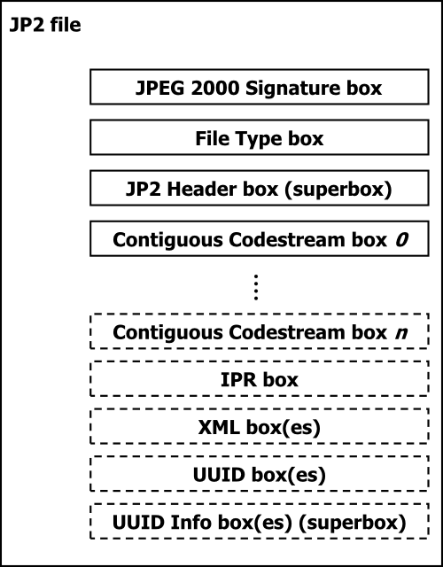
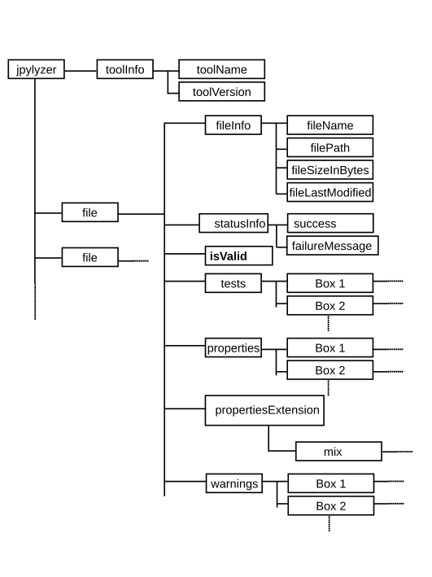
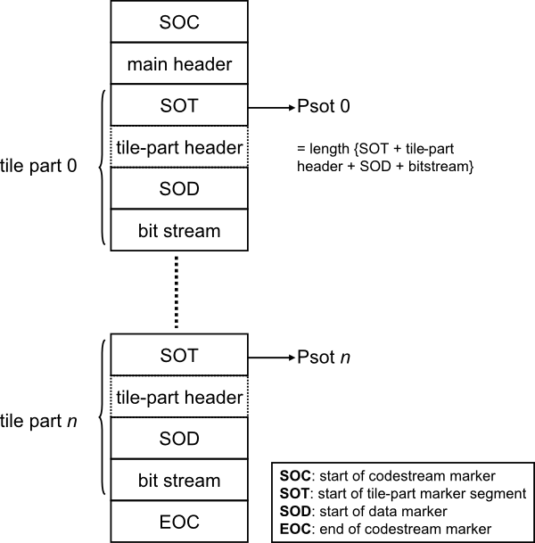

% Jpylyzer User Manual
%
%

Introduction {#introduction}
==============

About jpylyzer {#about-jpylyzer}
------------------

This User Manual documents *jpylyzer*, a validator and feature extractor
for JP2 images. JP2 is the still image format that is defined by JPEG
2000 Part 1 (ISO/IEC 15444-1). *Jpylyzer* was specifically created to
answer the following questions that you might have about any JP2 file:

1. Is this really a JP2 and does it really conform to the format's
specifications (validation)?

2. What are the technical characteristics of this image (feature
extraction)?

Validation: scope and restrictions {#validation-scope-and-restrictions}
--------------------------------------

Since the word ‘validation’ means different things to different people,
a few words about the overall scope of *jpylyzer*. First of all, it is
important to stress that *jpylyzer* is not a ‘one stop solution’ that
will tell you that an image is 100% perfect. What *jpylyzer* does is
this: based on the JP2 format specification (ISO/IEC 15444-1), it parses
a file. It then subjects the file’s contents to a large number of tests,
each of which is based on the requirements and restrictions that are
defined by the standard. If a file fails one or more tests, this implies
that it does not conform to the standard, and is no valid JP2.
Importantly, this presumes that *jpylyzer*’s tests accurately reflect
the format specification, without producing false positives.

### ‘Valid’ means ‘probably valid’

If a file passes all tests, this is an indication that it is *probably*
valid JP2. This (intentionally) implies a certain degree of remaining
uncertainty, which is related to the following.

First of all, *jpylyzer* (or any other format validator for that matter)
‘validates’ a file by trying to prove that it does *not* conform to the
standard. It cannot prove that that a file *does* conform to the
standard.

Related to this, even though *jpylyzer*’s validation process is very
comprehensive, it is not complete. For instance, the validation of JPEG
2000 codestreams at this moment is still somewhat limited. These limitations
are discussed in detail [here](#limitations-codestream-validation). 
Some of these limitations (e.g.
optional codestream segment markers that are only minimally supported at
this stage) may be taken away in upcoming versions of the tool.

### No check on compressed bitstreams

One important limitation that most certainly will *not* be addressed in
any upcoming versions is that *jpylyzer* does not analyse the data in
the compressed bitstream segments. Doing so would involve decoding the
whole image, and this is completely out of *jpylyzer*’s scope. As a
result, it is possible that a JP2 that passes each of *jpylyzer*’s tests
will nevertheless fail to render correctly in a viewer application.

### Recommendations for use in quality assurance workflows

Because of the foregoing, a thorough JP2 quality assurance workflow
should not rely on *jpylyzer* (or any other format validator) alone, but
it should include other tests as well. Some obvious examples are:

* A rendering test that checks if a file renders at all

* Format migration workflows (e.g. TIFF to JP2) should ideally also
include some comparison between source and destination images (e.g. a
pixel-wise comparison)

Conversely, an image that successfully passes a rendering test or
pixel-wise comparison may still contain problematic features (e.g.
incorrect colour space information), so validation, rendering tests and
pixel-wise comparisons are really complementary to each other.

Outline of this User Manual {#outline}
-------------------------------

We start by describing the [installation process](#installation) of *jpylyzer* for Windows
and Unix-based systems. We then explain its [basic usage](#using-jpylyzer), either as a command-line
tool, or as an importable Python module. This is followed by a brief overview of
[the structure of the JP2 format](#structure-jp2) and its ‘box’ structure, and an explanation of
*Jpylyzer*’s [output format](#output-format). The final sections give a detailed description of the tests
that *jpylyzer* performs for validation, and the properties that are reported in the output. The [penultimate section](#jp2-box-by-box) does this for all ‘boxes’, except the ‘Contiguous Codestream’ box, which is given a
[section of its own](#contiguous-codestream-box-chapter).

Funding {#funding}
-----------

The development of *jpylyzer* was funded by the EU FP 7 project SCAPE
(SCAlable Preservation Environments). More information about this
project can be found here:

[https://www.scape-project.eu/](https://www.scape-project.eu/)

License {#license}
-----------

*Jpylyzer* is free software: you can redistribute it and/or modify it
under the terms of the GNU Lesser General Public License as published by
the Free Software Foundation, either version 3 of the License, or (at
your option) any later version. This program is distributed in the hope
that it will be useful, but WITHOUT ANY WARRANTY; without even the
implied warranty of MERCHANTABILITY or FITNESS FOR A PARTICULAR PURPOSE.
See the GNU Lesser General Public License for more details. You should
have received a copy of the GNU Lesser General Public License along with
this program. If not, see:

[https://www.gnu.org/licenses/](https://www.gnu.org/licenses/)

On Debian systems, the complete text of the GNU Lesser General Public
License version 3 can be found in:

    /usr/share/common-licenses/LGPL-3

Installation and set-up {#installation}
=========================

Obtaining the software {#obtaining-the-software}
--------------------------

To obtain the latest version of the software please use the download
links at the *jpylyzer* homepage:

<https://jpylyzer.openpreservation.org/>

You have three options:

1. Install the software with the *Pip* package manager. This works on
all platforms (Windows, Linux, Mac, etc.), but you need to have
the Python interpreter available on your system. Jpylyzer is compatible with
Python 3.2 and more recent.

2. Alternatively, for Windows users there is also a set of stand-alone
binaries[^1]. These allow you to run *jpylyzer* as an
executable Windows application, without any need for installing Python.
This option is particularly useful for Windows users who cannot (or
don’t want to) install software on their system.

3. For Linux users Debian packages are available.

These options are described in the following sub-sections.

Installation with Pip (Linux/Unix, Windows, Mac OS X) {#installation-pip}
-----------------------------------------------------------------

### General installation procedure

First make sure you have a recent version of *pip*. Then install *jpylyzer*
with the following command:

    pip install jpylyzer

### Single user installation (Linux)

On most Linux systems the above command needs to be run as super user (see below).
If you don't want this use the below command for a single-user install:

    pip install jpylyzer --user

This will install the software to the `.local` folder (hidden by default!) in your
home directory (`~/.local`). Next try to run *jpylyzer* by entering:

    jpylyzer

Most likely this will result in:

    jpylyzer: command not found

If this happens, add the directory `~/.local/bin` (which is where the jpylyzer command-line
tool is installed) to the `PATH` environment variable (you only need to do this once).
To do this, locate the (hidden) file `.profile` in you home directory (`~/`), and open it in
a text editor. Then add the following lines at the end of the file:

    # set PATH so it includes the user's .local bin if it exists
    if [ -d "$HOME/.local/bin" ] ; then
        PATH="$HOME/.local/bin:$PATH"
    fi

Save the file, log out of your session and then log in again. Open a command terminal and type:

    jpylyzer

If all went well you now see this:

    usage: jpylyzer [-h] [--format FMT] [--mix {1,2}] [--nopretty]
              [--nullxml] [--recurse] [--packetmarkers] [--verbose]
              [--version] jp2In [jp2In ...]
    jpylyzer: error: the following arguments are required: jp2In

Which means that the installation was successful!

### Global installation (Linux)

Simply enter:

    sudo -H pip install jpylyzer

No further configuration is needed in this case.

### Note on pre-releases

The above command lines will only install stable versions of jpylyzer. In order to install the latest pre-release, add the `--pre` switch. For example:

    sudo -H pip install jpylyzer --pre

Installation of Windows binaries (Windows only) {#installation-windows}
---------------------------------------------------

Download the binary using the link on the *jpylyzer* homepage. Unzip the
contents of this file to an empty folder on your PC. *Jpylyzer* should
now be ready for use.

### Testing the installation

To test your installation, open a Command Prompt (‘DOS prompt’) and
type:

    %jpylyzerPath%\jpylyzer

In the above command, replace *%jpylyzerPath%* with the full path to the
*jpylyzer* installation directory (i.e. the directory that contains
‘jpylyzer.exe’ and its associated files). For example, if you extracted
the files to directory `c:\tools\jpylyzer`, the command would become:

    c:\tools\jpylyzer\jpylyzer

Executing this command should result in the following screen output:

    usage: jpylyzer [-h] [--format FMT] [--mix {1,2}] [--nopretty]
              [--nullxml] [--recurse] [--packetmarkers] [--verbose]
              [--version] jp2In [jp2In ...]
    jpylyzer: error: the following arguments are required: jp2In

### Running jpylyzer without typing the full path

Optionally, you may also want to add the full path of the *jpylyzer*
installation directory to the Windows ’Path’ environment variable. Doing
so allows you to run *jpylyzer* from any directory on your PC without
having to type the full path. In Windows 7 you can do this by selecting
‘settings’ from the ‘Start’ menu; then go to ‘control panel’/’system’
and go to the ‘advanced’ tab. Click on the ‘environment variables’
button. Finally, locate the ‘Path’ variable in the ‘system variables’
window, click on ‘Edit’ and add the full *jpylyzer* path (this requires
local Administrator privileges). The settings take effect on any newly
opened command prompt.

Installation of Debian packages (Ubuntu/Linux) {#installation-debian}
--------------------------------------------------

For Linux, Debian packages of *jpylyzer* exist.
To install, simply download the *.deb* file, double-click on it and
select *Install Package*. Alternatively you can also do this in the
command terminal by typing:

    sudo dpkg -i opf-jpylyzer_2.0.0_all.deb

In both cases you need to have administrative privileges.

For *Ubuntu* and *Debian* alternative packages are available in the
official release channels. To install simply run the following commands:

    sudo apt-get update
    sudo apt-get install python-jpylyzer

Using *jpylyzer* {#using-jpylyzer}
==================

Overview {#using-overview}
------------

This section describes the general use of *jpylyzer*. The first sub-sections
cover the use of *jpylyzer* as a command-line tool and as an importable
Python module.

Command-line usage {#command-line-usage}
----------------------

This section explains *jpylyzer*’s general command-line interface. For
the sake of brevity, full paths to *jpylyzer* are omitted. This means that,
depending on your system and settings, you may have to substitute each
occurrence of ‘jpylyzer’ with its full path, the corresponding
Windows binary, or a combination of both. The following examples
illustrate this:

|This User Manual|jpylyzer|
|:---------------|:----------|
|Substitution example Linux|`/home/jpylyzer/jpylyzer`|
|Substitution example Windows binaries|`c:\tools\jpylyzer\jpylyzer`|

Furthermore, command line arguments that are given between square
brackets (example: `[-h]`) are optional.

### Synopsis

*Jpylyzer* can be invoked using the following command-line arguments:

    usage: jpylyzer [-h] [--format FMT] [--mix {1,2}] [--nopretty]
              [--nullxml] [--recurse] [--packetmarkers] [--verbose]
              [--version] jp2In [jp2In ...]

#### Positional arguments

|Argument|Description|
|:--|:--|
|`jp2In`|input JP2 image(s), may be one or more (whitespace-separated) path expressions; prefix wildcard (\*) with backslash (\\) in Linux|

#### Optional arguments

|Argument|Description|
|:--|:--|
|`[-h, --help]`|show help message and exit|
|`[--format FMT]`|validation format; allowed values are `jp2` (used by default) and `j2c` (which activates raw codestream validation)|
|`[--mix {1,2}]`|report additional output in NISO MIX format (version 1.0 or 2.0)|
|`[--nopretty]`|suppress pretty-printing of XML output|
|`[--nullxml]`|extract null-terminated XML content from XML and UUID boxes(doesn't affect validation)|
|`[--recurse, -r]`|when analysing a directory, recurse into subdirectories|
|`[--packetmarkers]`|Report packet-level codestream markers (plm, ppm, plt, ppt)|
|`[--verbose]`|report test results in verbose format|
|`[-v, --version]`|show program's version number and exit|

Note that the input can either be a single image, a space-separated
sequence of images, a pathname expression that includes multiple images,
or any combination of the above. For example, the following command will
process one single image:

    jpylyzer rubbish.jp2

The next example shows how to process all files with a ‘jp2’ extension
in the current directory:

    jpylyzer *.jp2

Note that on Unix/Linux based systems pathname expressions may not work
properly unless you wrap them in quotation marks:

    jpylyzer "*.jp2"

### Output redirection

All output (except warning and system error messages) is directed to the
standard output device (stdout). By default this is the console screen.
Use your platform’s standard output redirection operators to redirect
output to a file. The most common situation will be to redirect the
output of one invocation of *jpylyzer* to an XML file, which can be done
with the ‘\>’ operator (both under Windows and Linux):

    jpylyzer jp2In > outputFile

E.g. the following command will run *jpylyzer* on image ‘rubbish.jp2’ and
redirects the output to file ‘rubbish.xml’:

    jpylyzer rubbish.jp2 > rubbish.xml

The format of the XML output is described [here](#output-format).

### ‘format’ option

By default, *jpylyzer* validates against the *JP2* format specification. Starting
with version 2.0, *jpylyzer* can also validate raw JPEG 2000 codestreams that are
not wrapped inside a *JP2* container. For codestream validation, use the `--format`
option with value `j2c`, e.g.:

    jpylyzer --format j2c rubbish.j2c > rubbish.xml

### ‘mix’ option

When this option is used, *jpylyzer* reports additional output in
[*NISO MIX*](https://www.loc.gov/standards/mix/) format. This option takes one argument
that defines whether *MIX* 1.0 or *MIX* 2.0 is used. For example, the following command
will result in *MIX* 2.0 output:

    jpylyzer --mix 2 rubbish.jp2 > rubbish.xml

The *MIX* output is wrapped inside a *file/propertiesExtension* element. Note that *MIX*
output is *only* written for files that are valid JP2 (files that are not valid result in
an empty *propertiesExtension* element). Also, the `--mix` option is ignored if `--format`
is set to `j2c`.

### ‘recurse’ option

If the `--recurse` option is used, *jpylyzer* will recursively traverse all
subdirectories of a filepath expression. E.g:

    jpylyzer /home/myJP2s/*.jp2 > rubbish.xml

In this case *jpylyzer* analyses all files that have a *.jp2* extension in 
directory */home/myJP2s* and all its subdirectories.

### ‘packetmarkers’ option

When this option is enabled, jpylyzer will report the properties of the following packet-level
codestream markers:

- PLM (packet length, main header) marker
- PPM (packed packet headers, main header) marker
- PLT (packet length, tile-part header) marker
- PPT (packed packet headers, tile-part header) marker

By default these are excluded from the output, in order to prevent excessive output size.

### ‘nullxml’ option

The *nullxml* option was added to enable extraction of XML content that
is terminated by a null-byte. By default *jpylyzer* doesn’t report the
XML in that case, because it throws an exception in the XML parser.
Apparently some old versions of the Kakadu demo applications would
erroneously add a null-byte to embedded XML, so this option can be used
to force extraction for images that are affected by this.

### User warnings

Under the following conditions *jpylyzer* will print a user warning to
the standard error device (typically the console screen):

#### No images to check
If there are no input images to check (typically because the value of
jp2In refers to a non-existent file), the following warning message is
shown:

    User warning: no images to check!

#### Unsupported box
In some cases you will see the following warning message:

    User warning: ignoring 'boxName' (validator function not yet implemented)

The reason for this: a JP2 file is made up of units that are called
‘boxes’. This is explained in more detail [here](#structure-jp2). Each ‘box’ has
its own dedicated validator function. At this stage validator functions
are still missing for a small number of (optional) boxes. *Jpylyzer*
will display the above warning message if it encounters a (yet)
unsupported box. Any unsupported boxes are simply ignored, and the
remainder of the file will be analyzed (and validated) normally.

#### Error while processing a file
In rare cases you may come across one of the following messages:

    User warning: memory error (file size too large)
 
Memory errors may occur for (very) large images. If you get this warning, try using 
a machine with more RAM. Also, a machine's chip architecture and the operating system
may put constraints on the amount of memory that can be allocated.

The following warning indicates an input error:

    User warning: I/O error (cannot open file)

Finally, the following messages most likely indicate a jpylyzer bug:  
   
    User warning:runtime error (please report to developers)

and:

    User warning: unknown error (please report to developers)

If you ever run into either of these two errors, please get in touch with the jpylyzer
developers. The easiest way to do this is to create a new issue at:

<https://github.com/openpreserve/jpylyzer/issues>

#### Unknown box
Occasionally, you may see this warning message:

    User warning: ignoring unknown box

This happens if *jpylyzer* encounters a box that is not defined by JPEG
2000 Part 1. It should be noted that, to a large extent, JPEG 2000 Part
1 permits the presence of boxes that are defined outside the standard.
Again, *jpylyzer* will simply ignore these and process all other boxes
normally.

Using *jpylyzer* as a Python module {#using-as-python-module}
---------------------------------------

Instead of using *jpylyzer* from the command-line, you can also import
it as a module in your own Python programs. To do so, install jpylyzer
with *pip*. Then import *jpylyzer* into your code by adding:

    from jpylyzer import jpylyzer

Subsequently you can call any function that is defined in *jpylyzer.py*.
In practice you will most likely only need the *checkOneFile* function. 
The following minimal script shows how this works:

    #! /usr/bin/env python3
    
    from jpylyzer import jpylyzer
    
    # Define JP2
    myFile = "/home/johan/jpylyzer-test-files/aware.jp2"
    
    # Analyse with jpylyzer, result to Element object
    myResult = jpylyzer.checkOneFile(myFile)
    
    # Return image height value
    imageHeight = myResult.findtext('./properties/jp2HeaderBox/imageHeaderBox/height')
    print(imageHeight)

Here, *myResult* is an *Element* object that can either be used directly, 
or converted to XML using the *ElementTree* module[^3]. The structure of the
element object follows the XML output that described [here](#output-format).

You may use the following optional arguments (which correspond to the command-line options explained above):

- validationFormat -  sets the validation format. Values: 'jp2' (default), 'jph', 'j2c' or 'jhc'.
- verboseFlag - report test results in verbose format. Values: False (default) or True.
- packetmarkersFlag - report packet-level codestream markers. Values: False (default) or True.
- nullxmlFlag - extract null-terminated XML content from XML and UUID boxes. Values: False (default) or True.
- mixFlag - report additional output in NISO MIX format (version 1.0 or 2.0). Values: 0 (default), 1 or 2.

As an example, for validating a raw JPEG 2000 codestream, call the *checkOneFile* function with the additional
*validationFormat* argument, and set it to `j2c`:

    # Define Codestream
    myFile = "/home/johan/jpylyzer-test-files/rubbish.j2c"
    
    # Analyse with jpylyzer, result to Element object
    myResult = jpylyzer.checkOneFile(myFile, 'j2c')

Java integration {#java-integration}
---------------------------------------

It is possible to integrate *jpylyzer* into Java applications[^21]. A test class that shows how this 
works is included in the source repo [here](https://github.com/openpreserve/jpylyzer/tree/master/jpylyzer/java_demo/CallJpylyzer.java).
This requires [Jython](https://www.jython.org/). Note that you may run into performance issues with (very)
large images in this case, as Jython does not support [memory mapping](https://docs.python.org/3/library/mmap.html),
so make sure you've got plenty of RAM available.

Structure of a JP2 file {#structure-jp2}
=========================

Scope of this section {#structure-scope}
-------------------------

This section gives a brief overview of the JP2 file format. A basic
understanding of the general structure of JP2 is helpful for
appreciating how *jpylyzer* performs its validation. It will also make
it easier to understand *jpylyzer*‘s extracted properties, as these are
reported as a hierarchical tree that corresponds to the internal
structure of JP2.

For an exhaustive description of every detail of the format you are
advised to consult Annex I (‘JP2 file format syntax’) and Annex A
(‘Codestream syntax’) of ISO/IEC 15444-1.

General format structure {#general-format-structure}
----------------------------

At the highest level, a JP2 file is made up of a collection of *boxes*.
A *box* can be thought of as the fundamental building block of the
format. Some boxes (‘superboxes’) are containers for other boxes. The Figure
below gives an overview of the top-level boxes in a JP2 file.

A number of things here are noteworthy to point out:

* Some of these boxes are required, whereas others (indicated with
dashed lines in the Figure) are optional.

* The order in which the boxes appear in the file is subject to some
constraints (e.g. the first box in a JP2 must always be a ‘Signature’
box, followed by a ‘File Type’ box).

* Some boxes may have multiple instances (e.g. ‘Contiguous Codestream’
box), whereas others must be unique (e.g. ‘JP2 Header’ box).

More specific details can be found in the standard. The important thing
here is that requirements like the above are something that should be
verified by a validator, and this is exactly what *jpylyzer* does at the
highest level of its validation procedure.

General structure of a box {#general-box-structure}
------------------------------

All boxes are defined by a generic binary structure, which is
illustrated by the following Figure: 

Most boxes are made up of the following three
components:

1. A fixed-length ‘box length’ field that indicates the total size of
the box (in bytes).

2. A fixed-length ‘box type’ field which specifies the type of
information that can be found in this box

3. The box contents, which contains the actual information within the
box. Its internal format depends on the box type. The box contents of a
‘superbox’ will contain its child boxes (which can be parsed
recursively).

In some cases a box will also contain an ‘extended box length field’.
This field is needed if the size of a box exceeds 232-1
bytes, which is the maximum value that can be stored in the 4-byte ‘box
length’ field.

Defined boxes in JP2 {#defined-boxes}
------------------------

The following Table (taken from Table I.2 in ISO/IEC 15444-1,
with minor modifications) lists all boxes that are defined in the standard.
Addition signs in the ‘box name’ column indicate boxes that are children of a
‘superbox’.

|Box name|Superbox|Required?|Purpose|
|:-----------|:-----------|:------------|:----------|
|JPEG 2000 Signature box|No|Required|Identifies the file as being part of the JPEG 2000 family of files.|
|File Type box|No|Required|Specifies file type, version and compatibility information, including specifying if this file is a conforming JP2 file or if it can be read by a conforming JP2 reader.|
|JP2 Header box|Yes|Required|Contains a series of boxes that contain header-type information about the file.|
|+ Image Header box|No|Required|Specifies the size of the image and other related fields.|
|+ Bits Per Component box|No|Optional|Specifies the bit depth of the components in the file in cases where the bit depth is not constant across all components.|
|+ Colour Specification box|No|Required|Specifies the colourspace of the image.|
|+ Palette box|No|Optional|Specifies the palette which maps a single component in index space to a multiple-component image.|
|+ Component Mapping box|No|Optional|Specifies the mapping between a palette and codestream components.|
|+ Channel Definition box|No|Optional|Specifies the type and ordering of the components within the codestream, as well as those created by the application of a palette.|
|+ Resolution box|Yes|Optional|Contains the grid resolution.|
|++ Capture Resolution box|No|Optional|Specifies the grid resolution at which the image was captured.|
|++ Default Display Resolution box|No|Optional|Specifies the default grid resolution at which the image should be displayed.|
|Contiguous Codestream box|No|Required|Contains the codestream.|
|Intellectual Property box|No|Optional|Contains intellectual property information about the image.|
|XML box|No|Optional|Provides a tool by which vendors can add XML formatted information to a JP2 file.|
|UUID box|No|Optional|Provides a tool by which vendors can add additional information to a file without risking conflict with other vendors.|
|UUID Info box|Yes|Optional|Provides a tool by which a vendor may provide access to additional information associated with a UUID.|
|+ UUID List box|No|Optional|Specifies a list of UUIDs.|
|+ URL box|No|Optional|Specifies a URL.|

A JP2 file may contain boxes that are not defined by the standard. Such boxes
are simply skipped and ignored by conforming reader applications. 

Output format {#output-format}
===============

This section explains *jpylyzer*’s output format.

Overview {#output-format-overview}
------------

*Jpylyzer* generates its output in XML format, which is defined by [the schema that can be found here](https://jpylyzer.openpreservation.org/jpylyzer-v-2-1.xsd). The following Figure shows the
output structure:

The root element (*jpylyzer*) contains the following child elements:

1. one *toolInfo* element, which contains information about *jpylyzer*

2. one or more *file* elements, each of which contain information about about the analysed files

The XML output is pretty-printed. You can use the `--nopretty` switch to disable
pretty-printing (this produces smaller files and may give a slightly
better performance).

toolInfo element {#toolinfo-element}
--------------------

This element holds information about *jpylyzer*. Currently it contains
the following sub-elements:

* *toolName*: name of the analysis tool (i.e. *jpylyzer* or
*jpylyzer.exe*, depending on the platform used)

* *toolVersion*: version of *jpylyzer* (*jpylyzer* uses a date
versioning scheme)

file element {#file-element}
--------------------

The *file* element contains the following sub-elements:

1. *fileInfo*: general information about the analysed file

2. *statusInfo*: information about the status of *jpylyzer*'s validation attempt

3. *isValid*: outcome of the validation

4. *tests*: outcome of the individual tests that are part of the
validation process (organised by box)

5. *properties*: image properties (organised by box)

6. *propertiesExtension*: wrapper element for NISO *MIX* output (only if the `--mix` option is used)

fileInfo element {#fileinfo-element}
--------------------

This element holds general information about the analysed file.
Currently it contains the following sub-elements:

* *filename*: name of the analysed file without its path (e.g.
“rubbish.jp2”)

* *filePath*: name of the analysed file, including its full absolute
path (e.g. “d:\\data\\images\\rubbish.jp2”)

* *fileSizeInBytes*: file size in bytes

* *fileLastModified*: last modified date and time

statusInfo element {#statusinfo-element}
--------------------

This element holds general information about about the status of 
*jpylyzer*'s attempt at validating a file. It tells you whether 
the validation process could be completed without any internal
*jpylyzer* errors. It contains the following sub-elements:

* *success*: a Boolean flag that indicates whether the validation attempt 
completed normally (“True”) or not (“False”). A value of “False” indicates
an internal error that prevented *jpylyzer* from validating the file. 

* *failureMessage*: if the validation attempt failed (value of *success* 
equals “False”), this field gives further details about the reason of the failure.
Examples are:

  * `memory error (file size too large)`
  * `runtime error (please report to developers)`
  * `unknown error (please report to developers)`

isValid element {#isvalid-element}
----------------------

This element contains the results of the validation. If a file passed
all the tests (i.e. all tests returned “True”, see [here](#tests-element)) it is
most likely valid, and the value of *isValid* will be “True”. Its value is “False” otherwise.
The element has a *format* attribute, which defines the validation format (set by the
`--format` command-line option). The *format* attribute can have the following values:

* “jp2” (JP2 validation)
* “j2c” (raw codestream validation)

tests element {#tests-element}
-----------------

This element is reserved to hold the outcomes of all the individual
tests that *jpylyzer* performs to assess whether a file is valid JP2.
The results are organised in a hierarchical tree that corresponds to
JP2’s box structure. Each individual test can have two values:

* “True” if a file passed the test.

* “False” if a file failed the test.

If a file passed *all* tests, this is an indication that it is most
likely valid JP2. In that case, the [*isValid* element](#isvalid-element)
has a value of “True” (and “False” in all other cases). These tests are
all explained [here](#jp2-box-by-box) and [here](#contiguous-codestream-box-chapter).

### Default and verbose reporting of test results

By default, *jpylyzer* only reports any tests that failed (i.e. returned
“False”), including the corresponding part of the box structure. For a
valid JP2 the tests element will be empty. If the --verbose flag is
used, the results of *all* tests are included (including those that
returned “True”)[^4].

properties element {#properties-element}
----------------------

This element contains the extracted image properties, which are
organised in a hierarchical tree that corresponds to JP2’s box
structure. See [here](#jp2-box-by-box) and [here](#contiguous-codestream-box-chapter) for a description of the reported
properties.

propertiesExtension element {#propertiesExtension-element}
----------------------

This optional element is reserved for output in alternative formats. Currently it is used to wrap output in NISO *MIX* format
if the `--mix` option is used. See the [*MIX* documentation](https://www.loc.gov/standards/mix/) for a description of the reported elements.

JP2: box by box {#jp2-box-by-box}
=================

The following two sections provide a detailed explanation of
*jpylyzer*’s functionality and its output. In particular, the following
two aspects are addressed:

1. The reported properties

2. The tests that *jpylyzer* performs to establish the validity of a
file.

About the properties and tests trees {#about-properties-tests-trees}
----------------------------------------

The ‘properties’ element in *jpylyzer*’s output holds a hierarchical
tree structure that contains all extracted properties. The ‘tests’ tree
follows the same structure. The hierarchy reflects JP2’s box structure
(explained [here](#structure-jp2)): each box is represented by a corresponding
output element that contains the corresponding property entries. If a
box is a superbox, the output element will contain child elements for
each child box. For some boxes, the output contains further
sub-elements. This applies in particular to the Contiguous Codestream
box, since its contents are more complex than any of the other boxes.
Also, if a Colour Specification box contains an embedded ICC profile,
the properties of the ICC profile are stored in a separate sub-element.
In addition to this, one ‘property’ that is reported by *jpylyzer* (the
compression ratio) is not actually extracted from any particular box.
Instead, it is calculated from the file size and some properties from
the Header boxes. As a result, it is reported separately in the root of
the properties tree.

### Naming of properties

The naming of the reported properties largely follows the standard
(ISO/IEC 15444-1). Some minor differences follow from the fact that the
standard does have any consistent use of text case, whereas *jpylyzer*
uses lower camel case. In addition, some parameters in the standard are
compound units that aggregate a number of Boolean ‘switches’, where no
names are provided for each individual switch. An example of this is the
*Scod* (coding style) parameter in the codestream header, which contains
three switches that define the use of precincts, start-of-packet markers
and end-of-packet markers. For cases like these *jpylyzer* uses its own
(largely self-descriptive) names (which are all documented in these
sections).

JPEG 2000 Signature box {#jpeg2000-signature-box}
---------------------------

This box contains information that allows identification of the file as
being part of the JPEG 2000 family of file formats.

### Element name

signatureBox

### Reported properties

None (box only holds JPEG 2000 signature, which includes non-printable
characters)

### Tests

|Test name|True if|
|:--------|:------|
|boxLengthIsValid|Size of box contents equals 4 bytes|
|signatureIsValid|Signature equals 0x0d0a870a|

File Type box {#file-type-box}
-----------------

This box specifies file type, version and compatibility information,
including specifying if this file is a conforming JP2 file or if it can
be read by a conforming JP2 reader.

### Element name

fileTypeBox

### Reported properties

|Property|Description|
|:-------|:----------|
|br|Brand|
|minV|Minor version|
|cL\*|Compatibility field (repeatable)|

### Tests

|Test name|True if|
|:--------|:------|
|boxLengthIsValid|(Size of box – 8) /4 is a whole number (integer)|
|brandIsValid|*br* equals 0x6a703220 (“jp2 ”) for JP2, or 0x6a706820 (“jph ”)for JPH|
|minorVersionIsValid|*minV* equals 0|
|compatibilityListIsValid|Sequence of compatibility (*cL*) fields includes one entry that equals 0x6a703220 (“jp2 ”) for JP2, or 0x6a706820 (“jph ”)for JPH|

JP2 Header box (superbox) {#jp2-header-box}
-----------------------------

This box is a superbox that holds a series of boxes that contain
header-type information about the file.

### Element name

jp2HeaderBox

### Reported properties

Since this is a superbox, it contains a number of child boxes. These are
represented as child elements in the properties tree:

|Child element|Description|
|:------------|:----------|
|[imageHeaderBox](#image-header-box)|Properties from Image Header box (required)|
|[bitsPerComponentBox](#bits-per-component-box)|Properties from Bits Per Component box (optional)|
|[ColourSpecificationBox](#colour-specification-box)|Properties from Colour Specification box (required)|
|[paletteBox](#palette-box)|Properties from Palette box (optional)|
|[componentMappingBox](#component-mapping-box)|Properties from Component Mapping box (optional)|
|[channelDefinitionBox](#channel-definition-box)|Properties from Channel Definition box (optional)|
|[resolutionBox](#resolution-box)|Properties from Resolution box (optional)|

### Tests

|Test name|True if|
|:--------|:------|
|containsImageHeaderBox|Box contains required Image Header box|
|containsColourSpecificationBox|Box contains required Colour Specification box|
|containsBitsPerComponentBox|Box contains Bits Per Component Box, which is required if *bPCSign* and *bPCDepth* in Image Header Box equal 1 and 128, respectively (test is skipped otherwise)|
|firstJP2HeaderBoxIsImageHeaderBox|First child box is Image Header Box|
|noMoreThanOneImageHeaderBox|Box contains no more than one Image Header box|
|noMoreThanOneBitsPerComponentBox|Box contains no more than one Bits Per Component box|
|noMoreThanOnePaletteBox|Box contains no more than one Palette box|
|noMoreThanOneComponentMappingBox|Box contains no more than one Component Mapping box|
|noMoreThanOneChannelDefinitionBox|Box contains no more than one Channel Definition box|
|noMoreThanOneResolutionBox|Box contains no more than one Resolution box|
|colourSpecificationBoxesAreContiguous|In case of multiple Colour Specification boxes, they appear contiguously in the JP2 Header box|
|paletteAndComponentMappingBoxesOnlyTogether|Box contains a Palette box (only if Component Mapping box is present); box contains a Component Mapping box (only if Palette box is present)|
|noZeroCTypesIfNoColourBox|If file does not contain a Colour Specification Box, no cTyp values (from Channel definition box) shall be equal to 0 (JPH)|

Image Header box (child of JP2 Header box) {#image-header-box}
----------------------------------------------

This box specifies the size of the image and other related fields.

### Element name

imageHeaderBox

### Reported properties

|Property|Description|
|:-------|:----------|
|height|Image height in pixels|
|width|Image width in pixels|
|nC|Number of image components|
|bPCSign|Indicates whether image components are signed or unsigned|
|bPCDepth|Number of bits per component|
|c|Compression type|
|unkC|Colourspace Unknown field (“yes” if colourspace of image data is unknown; “no” otherwise)|
|iPR|Intellectual Property field (“yes” if image contains intellectual property rights information; “no” otherwise)|

### Tests

|Test name|True if|
|:--------|:------|
|boxLengthIsValid|Size of box contents equals 14 bytes|
|heightIsValid|*height* is within range [1, 232 - 1]|
|widthIsValid|*width* is within range [1, 232 - 1]|
|nCIsValid|*nC* is within range [1, 16384]|
|bPCIsValid|*bPCDepth* is within range [1,38] OR *bPCSign* equals 255 (in the latter case the bit depth is variable)|
|cIsValid|*c* equals 7 (“jpeg2000”)|
|unkCIsValid|*unkC* equals 0 (“no”) or 1 (“yes”)|
|iPRIsValid|*iPR* equals 0 (“no”) or 1 (“yes”)|

Bits Per Component box (child of JP2 Header box) {#bits-per-component-box}
----------------------------------------------------

This (optional) box specifies the bit depth of the components in the
file in cases where the bit depth is not constant across all components.

### Element name

bitsPerComponentBox

### Reported properties

|Property|Description|
|:-------|:----------|
|bPCSign\*|Indicates whether image component is signed or unsigned (repeated for all components)|
|bPCDepth\*|Number of bits for this component (repeated for all components)|

### Tests

|Test name|True if|
|:--------|:------|
|bPCIsValid\*|*bPCDepth* is within range [1,38] (repeated for all components)|

Colour Specification box (child of JP2 Header box) {#colour-specification-box}
------------------------------------------------------

This box specifies the colourspace of the image.

### Element name

colourSpecificationBox

### Reported properties

|Property|Description|
|:-------|:----------|
|meth|Specification method. Indicates how the colourspace is defined (enumerated colourspace, or restricted ICC profile for JP2, with additional Any ICC and Parameterized Colourspace methods for JPH.|
|prec|Precedence|
|approx|Colourspace approximation|
|enumCS (if meth equals “Enumerated”)|Enumerated colourspace (as descriptive text string)|
|icc (if meth equals “Restricted ICC” or “Any ICC”)|Properties of ICC profile as child element (see below)|
|colPrims (if meth equals “Parameterized Colourspace”)|ColourPrimaries value (JPH)[^22].|
|transfC (if meth equals “Parameterized Colourspace”)|TransferCharacteristics value (JPH)[^23]|
|matCoeffs (if meth equals “Parameterized Colourspace”)|MatrixCoefficients value (JPH)[^24]|
|vidFRng (if meth equals “Parameterized Colourspace”)|VideoFullRangeFlag (“yes”/”no”) (JPH)[^25]|

### Reported properties of ICC profiles

If the colour specification box contains an embedded ICC profile,
*jpylyzer* will also report the following properties (which are all
grouped in an “icc” sub-element in the properties tree). An exhaustive
explanation of these properties is given in the ICC specification (ISO
15076-1 / ICC.1:2004-10). Note that *jpylyzer* does *not* validate
embedded ICC profiles (even though it does check if a specific ICC
profile is allowed in JP2)!

|Property|Description|
|:-------|:----------|
|profileSize|Size of ICC profile in bytes|
|preferredCMMType|Preferred CMM type|
|profileVersion|Profile version. Format: “majorRevision.minorRevision.bugFixRevision”|
|profileClass|Profile/device class|
|colourSpace|Colourspace|
|profileConnectionSpace|Profile connection space|
|dateTimeString|Date / time string. Format: “YYYY/MM/DD, h:m:s”|
|profileSignature|Profile signature|
|primaryPlatform|Primary platform|
|embeddedProfile|Flag that indicates whether profile is embedded in file (“yes”/”no”)|
|profileCannotBeUsedIndependently|Flag that indicates whether profile can*not* (!) be used independently from the embedded colour data (“yes”/”no”)|
|deviceManufacturer|Identifies a device manufacturer|
|deviceModel|Identifies a device model|
|transparency|Indicates whether device medium is reflective or transparent|
|glossiness|Indicates whether device medium is glossy or matte|
|polarity|Indicates whether device medium is positive or negative|
|colour|Indicates whether device medium is colour or black and white|
|renderingIntent|Rendering intent|
|connectionSpaceIlluminantX|Profile connection space illuminant X|
|connectionSpaceIlluminantY|Profile connection space illuminant Y|
|connectionSpaceIlluminantZ|Profile connection space illuminant Z|
|profileCreator|Identifies creator of profile|
|profileID|Profile checksum (as hexadecimal string)|
|tag\*|Signature of profile tag (repeated for all tags in the profile)|
|description|Profile description (extracted from ‘desc’ tag)|

### Tests

|Test name|True if|
|:--------|:------|
|methIsValid|*meth* equals 1 (enumerated colourspace) or 2 (restricted ICC profile)|
|precIsValid|*prec* equals 0|
|approxIsValid|*approx* equals 0|
|enumCSIsValid (if meth equals “Enumerated”)|*enumCS* equals 16 (“sRGB”), 17 (“greyscale”) or 18 (“sYCC”)|
|iccSizeIsValid (if meth equals “Restricted ICC”)|Actual size of embedded ICC profile equals value of profileSize field in ICC header|
|iccPermittedProfileClass (if meth equals “Restricted ICC”)|ICC profile class is “input device” or “display device”[^6]|
|iccNoLUTBasedProfile (if meth equals “Restricted ICC”)|ICC profile type is not N-component LUT based (which is not allowed in JP2)|
|colPrimsIsValid|*colPrims* value is defined by ITU-T H.273 / ISO/IEC 23001-8 (JPH)|
|transfCIsValid|*transfC* value is defined by ITU-T H.273 / ISO/IEC 23001-8 (JPH)|
|matCoeffsIsValid|*matCoeffs* value is defined by ITU-T H.273 / ISO/IEC 23001-8 (JPH)|

Palette box (child of JP2 Header box) {#palette-box}
-----------------------------------------

This (optional) box specifies the palette which maps a single component
in index space to a multiple-component image.

### Element name

paletteBox

### Reported properties

|Property|Description|
|:-------|:----------|
|nE|Number of entries in the table|
|nPC|Number of palette columns|
|bSign\*|Indicates whether values created by this palette column are signed or unsigned (repeated for all columns)|
|bDepth\*|Bit depth of values created by this palette column (repeated for all columns)|
|cP\*\*|Value for this entry (repeated for all columns, and for the number of entries)|

### Tests

|Test name|True if|
|:--------|:------|
|nEIsValid|*nE* is within range [0,1024]|
|nPCIsValid|*nPC* is within range [1,255]|
|bDepthIsValid\*|*bDepth* is within range [1,38] (repeated for all columns)|

Component Mapping box (child of JP2 Header box) {#component-mapping-box}
---------------------------------------------------

This (optional) box specifies the mapping between a palette and
codestream components.

### Element name

componentMappingBox

### Reported properties

|Property|Description|
|:-------|:----------|
|cMP\*|Component index (repeated for all channels)|
|mTyp\*|Specifies how channel is generated from codestream component (repeated for all channels)|
|pCol\*|Palette component index (repeated for all channels)|

### Tests

|Test name|True if|
|:--------|:------|
|cMPIsValid|*cMP* is within range [0,16384]|
|mTypIsValid\*|*mTyp* is within range [0,1] (repeated for all channels)|
|pColIsValid\*|*pCol* is 0 if *mTyp* is 0 (repeated for all channels)|

Channel Definition box (child of JP2 Header box) {#channel-definition-box}
-----------------------------------------------------

This (optional) box specifies the type and ordering of the components
within the codestream, as well as those created by the application of a
palette.

### Element name

channelDefinitionBox

### Reported properties

|Property|Description|
|:-------|:----------|
|n|Number of channel descriptions|
|cN\*|Channel index (repeated for all channels)|
|cTyp\*|Channel type (repeated for all channels)|
|cAssoc\*|Channel association (repeated for all channels)|

### Tests

|Test name|True if|
|:--------|:------|
|nIsValid|*n* is within range [1, 65535]|
|boxLengthIsValid|(Size of box – 2) / equals 6\**n*|
|cNIsValid\*|*cN* is within range [0, 65535] (repeated for all channels)|
|cTypIsValid\*|*cType* is one of the values defined in Table I.16 (repeated for all channels)[^26]|
|cAssocIsValid\*|*cAssoc* is within range [0, 65535] (repeated for all channels)|
|noMoreThanOneAlphaChannel|At most one *cTyp* field is equal to 1 or 2 (JPH)|
|cAssocAlphaChannelIsZero|If *cTyp* is 1 or 2, the corresponding *cAssoc* value equals 0 (JPH)|

Resolution box (child of JP2 Header box, superbox) {#resolution-box}
-------------------------------------------------------

This (optional) box contains the grid resolution.

### Element name

resolutionBox

### Reported properties

Since this is a superbox, it contains one or two child boxes. These are
represented as child elements in the properties tree:

|Child element|Description|
|:------------|:----------|
|[captureResolutionBox](#capture-resolution-box)|Properties from Capture Resolution box|
|[displayResolutionBox](#display-resolution-box)|Properties from Default Display Resolution box|

### Tests

|Test name|True if|
|:--------|:------|
|containsCaptureOrDisplayResolutionBox|Box contains either a Capture Resolution box or a Default Display Resolution box, or both|
|noMoreThanOneCaptureResolutionBox|Box contains no more than one Capture Resolution box|
|noMoreThanOneDisplayResolutionBox|Box contains no more than one Default Display Resolution box|

Capture Resolution box (child of Resolution box) {#capture-resolution-box}
-----------------------------------------------------

This (optional) box specifies the grid resolution at which the image was
captured.

### Element name

captureResolutionBox

### Reported properties

Resolution information in this box is stored as a set of vertical and
horizontal numerators, denominators and exponents. *Jpylyzer* also
reports the corresponding grid resolutions in pixels per meter and
pixels per inch, which are calculated from these values.

|Property|Description|
|:-------|:----------|
|vRcN|Vertical grid resolution numerator|
|vRcD|Vertical grid resolution denominator|
|hRcN|Horizontal grid resolution numerator|
|hRcD|Horizontal grid resolution denominator|
|vRcE|Vertical grid resolution exponent|
|hRcE|Horizontal grid resolution exponent|
|vRescInPixelsPerMeter|Vertical grid resolution, expressed in pixels per meter[^7]|
|hRescInPixelsPerMeter|Horizontal grid resolution, expressed in pixels per meter[^8]|
|vRescInPixelsPerInch|Vertical grid resolution, expressed in pixels per inch[^9]|
|hRescInPixelsPerInch|Horizontal grid resolution, expressed in pixels per inch[^10]|

### Tests

|Test name|True if|
|:--------|:------|
|boxLengthIsValid|Size of box contents equals 10 bytes|
|vRcNIsValid|*vRcN* is within range [1,65535]|
|vRcDIsValid|*vRcD* is within range [1,65535]|
|hRcNIsValid|*hRcN* is within range [1,65535]|
|hRcDIsValid|*hRcD* is within range [1,65535]|
|vRcEIsValid|*vRcE* is within range [-127,128]|
|hRcEIsValid|*hRcE* is within range [-127,128]|

Default Display Resolution box (child of Resolution box) {#display-resolution-box}
-------------------------------------------------------------

This (optional) box specifies the default grid resolution at which the
image should be displayed.

### Element name

displayResolutionBox

### Reported properties

Resolution information in this box is stored as a set of vertical and
horizontal numerators, denominators and exponents. *Jpylyzer* also
reports the corresponding grid resolutions in pixels per meter and
pixels per inch, which are calculated from these values.

|Property|Description|
|:-------|:----------|
|vRdN|Vertical grid resolution numerator|
|vRdD|Vertical grid resolution denominator|
|hRdN|Horizontal grid resolution numerator|
|hRdD|Horizontal grid resolution denominator|
|vRdE|Vertical grid resolution exponent|
|hRdE|Horizontal grid resolution exponent|
|vResdInPixelsPerMeter|Vertical grid resolution, expressed in pixels per meter[^11]|
|hResdInPixelsPerMeter|Horizontal grid resolution, expressed in pixels per meter[^12]|
|vResdInPixelsPerInch|Vertical grid resolution, expressed in pixels per inch[^13]|
|hResdInPixelsPerInch|Horizontal grid resolution, expressed in pixels per inch[^14]|

### Tests

|Test name|True if|
|:--------|:------|
|boxLengthIsValid|Size of box contents equals 10 bytes|
|vRdNIsValid|*vRdN* is within range [1,65535]|
|vRdDIsValid|*vRdD* is within range [1,65535]|
|hRdNIsValid|*hRdN* is within range [1,65535]|
|hRdDIsValid|*hRdD* is within range [1,65535]|
|vRdEIsValid|*vRdE* is within range [-127,128]|
|hRdEIsValid|*hRdE* is within range [-127,128]|

Contiguous Codestream box {#codestream-box}
------------------------------

This box contains the codestream. See [here](#contiguous-codestream-box-chapter).

Intellectual Property box {#intellectual-property-box}
------------------------------

This (optional) box contains intellectual property information about the
image. The JP2 format specification (ISO/IEC 15444-1) does not provide
any specific information about this box, other than stating that “the
definition of the format of [its] contents […] is reserved for ISO”. As
a result, *jpylyzer* does not currently include a validator function for
this box, which is now simply ignored. *Jpylyzer* will display a user
warning message in that case.

XML box {#xml-box}
------------

This (optional) box contains XML formatted information.

### Element name

xmlBox

### Reported properties

If the contents of this box are well-formed XML (see ‘tests’ below), the
‘xmlBox’ element in the properties tree will contain the contents of the
XML box. Note that, depending on the character encoding of the original
XML, it may contain characters that are not allowed in the encoding that
is used for *jpylyzer*’s output. Any such characters will be represented
by numerical entity references in the output. If the box contents are
not well-formed XML, no properties are reported for this box.

### Tests

|Test name|True if|
|:--------|:------|
|containsWellformedXML|Contents of box are parsable, well-formed XML|

Note that *jpylyzer* does not check whether the XML is *valid*, as this
is not required by the standard. Besides, doing so would make *jpylyzer*
significantly slower for XML that contains references to external
schemas and DTDs.

UUID box {#uuid-box}
-------------

This (optional) box contains additional (binary) information, which may
be vendor-specific. Some applications (e.g. Kakadu and ExifTool) also
use this box for storing XMP metadata (see Section 1.1.4 in Part 3 of
the XMP specification[^15]).

### Element name

uuidBox

### Reported properties

If the value of *uuid* indicates the presence of XMP metadata and the
contents of this box are well-formed XML, (see ‘tests’ below), the
‘uuidBox’ element in the properties tree will contain the XMP data. Note
that, depending on the character encoding of the original XML, it may
contain characters that are not allowed in the encoding that is used for
*jpylyzer*’s output. Any such characters will be represented by
numerical entity references in the output. In all other cases, the
‘uuidBox’ element will contain a standard string representation the of
UUID.

|Property|Description|
|:-------|:----------|
|uuid|Standard string representation of UUID (**only** if uuid has value other than *be7acfcb-97a9-42e8-9c71-999491e3afac*). For an explanation of UUIDs see e.g. Leach *et al*., 2005.|
|XMP data|XMP metadata (**only** if uuid has value *be7acfcb-97a9-42e8-9c71-999491e3afac*)|

Note that except for the XMP case, *jpylyzer* will not be able to report
any information on the actual contents of this box, since it is defined
outside of the scope of JPEG 2000.

### Tests

|Test name|True if|
|:--------|:------|
|boxLengthIsValid|Size of box contents is greater than 16 bytes|
|containsWellformedXML|Contents of box are parsable, well-formed XML (this test is **only** performed if uuid has value *be7acfcb-97a9-42e8-9c71-999491e3afac*)|

UUID Info box (superbox) {#uuid-info-box}
-----------------------------

This (optional) box contains additional information associated with a
UUID.

### Element name

uuidInfoBox

### Reported properties

This is a superbox which contains two child boxes. These are represented
as child elements in the properties tree:

|Child element|Description|
|:------------|:----------|
|[uuidListBox](#uuid-list-box)|Properties from UUID List box|
|[urlBox](#data-entry-url-box)|Properties from Data Entry URL box|

### Tests

|Test name|True if|
|:--------|:------|
|containsOneListBox|Box contains exactly one UUID List box|
|containsOneURLBox|Box contains exactly one Data Entry URL box|

UUID List box (child of UUID Info box) {#uuid-list-box}
-------------------------------------------

This (optional) box specifies a list of UUIDs.

### Element name

uuidListBox

### Reported properties

|Property|Description|
|:-------|:----------|
|nU|Number of UUIDs|
|uuid\*|Standard string representation of UUID (repeated *nU* times)|

### Tests

|Test name|True if|
|:--------|:------|
|boxLengthIsValid|Size of box equals *nU* \* 16 + 2|

Data Entry URL box (child of UUID Info box) {#data-entry-url-box}
------------------------------------------------

This (optional) box specifies a URL.

### Element name

urlBox

### Reported properties

|Property|Description|
|:-------|:----------|
|version|Version number|
|loc|Location, which specifies a URL of the additional information associated with the UUIDs in the UUID List box that resides in the same UUID Info box|

### Tests

|Test name|True if|
|:--------|:------|
|flagIsValid|Three bytes that make up “flag” field equal 0x00 00 00 (‘flag’ is not reported to output because it only contains null bytes)|
|locIsUTF8|Location (URL) can be decoded to UTF-8|
|locHasNullTerminator|Location (URL) is a null-terminated string|

Unknown box {#unknown-box-section}
----------------

An image may contain boxes that are not defined by ISO/IEC 15444-1.
Although *jpylyzer* ignores such boxes, it will report some minimal info
that will allow interested users to identify them to a limited extent.

### Element name

unknownBox

### Reported properties

|Property|Description|
|:-------|:----------|
|boxType|Four-character text string that specifies the type of information that is found in this box (corresponds to *TBox* in section I.4 of ISO/IEC 15444-1).|

Top-level tests and properties {#top-level-tests-properties}
-----------------------------------

This sub-section describes the tests and output for the top file level.

### Element name

properties

### Reported properties

The metrics that are listed here are not ‘properties’ in a strict sense;
instead they are secondary or derived metrics that are calculated by
combining information from different parts / boxes of the file.

|Property|Description|
|:-------|:----------|
|compressionRatio|Compression ratio|

The compression ratio is calculated as the ratio between the size of the
uncompressed image data and the actual file size:

<math xmlns="http://www.w3.org/1998/Math/MathML">
<mrow>
  <mi>compressionRatio</mi>
  <mo>=</mo>
  <mfrac>
    <mrow>
      <mi>sizeUncompressed</mi>
    </mrow>
    <mrow>
      <mi>sizeCompressed</mi>
    </mrow>
  </mfrac>
</mrow>
</math>

Here, *sizeCompressed* is simply the file size (*fileSizeInBytes* in
output file’s ‘fileInfo’ element). The uncompressed size (in bytes) can
be calculated by multiplying the number of bytes per pixel by the total
number of pixels:

<math xmlns="http://www.w3.org/1998/Math/MathML">
<mrow>
  <mi>sizeUncompressed</mi>
  <mo>=</mo>
  <mfrac>
    <mrow>
      <mn>1</mn>
    </mrow>
    <mrow>
      <mn>8</mn>
    </mrow>
  </mfrac>
  <munderover>
          <mo>&sum;</mo>
      <mrow>
        <mi>i</mi>
        <mo>=</mo>
        <mn>1</mn>
      </mrow>
        <mi>nC</mi>
  </munderover>
  <msub>
          <mi>bPCDepth</mi>
        <mi>i</mi>
  </msub>
  <mo>&bull;</mo>
  <mi>height</mi>
  <mo>&bull;</mo>
  <mi>width</mi>
</mrow>
</math>

With:

nC
:   number of image components (from Image Header box)

i
:   component index

bPCDepthi
:   bits per component for component *i* (from Image Header box or Bits Per Component box)

height
:   image height (from Image Header box)

width
:   image width (from Image Header box)

In addition, the root of the properties tree contains the elements for
all top-level boxes:

|Child element|Description|
|:------------|:----------|
|[signatureBox](#jpeg2000-signature-box)|Properties from JPEG 2000 Signature box|
|[fileTypeBox](#file-type-box)|Properties from File Type box|
|[jp2HeaderBox](#jp2-header-box)|Properties from JP2 Header box|
|[contiguousCodestreamBox](#contiguous-codestream-box-chapter)|Properties from Contiguous Codestream box|
|[intellectualPropertyBox](#intellectual-property-box)|Properties from Intellectual Property box (optional)|
|[xmlBox](#xml-box)|Properties from XML box (optional)|
|[uuidBox](#uuid-box)|Properties from UUID box (optional)|
|[uuidInfoBox](#uuid-info-box)|Properties from UUID Info box (optional)|

### Tests

The tests that *jpylyzer* performs at the root level fall in either of
the following two categories:

1. Tests for the presence of required top-level boxes, the order in
which they appear and restrictions on the number of instances for
specific boxes

2. Tests for consistency of information in different parts of the file.
In particular, a lot of the information in the Image Header box is
redundant with information in the codestream header, and *jpylyzer*
performs a number of tests to verify the consistency between these two.

|Test name|True if|
|:--------|:------|
|containsSignatureBox|File root contains a JPEG 2000 Signature box|
|containsFileTypeBox|File root contains a File Type box|
|containsJP2HeaderBox|File root contains a JP2 Header box|
|containsContiguousCodestreamBox|File root contains a Contiguous Codestream box|
|containsIntellectualPropertyBox|File root contains an Intellectual Property box, which is required if *iPR* field in Image Header Box equals 1 (test is skipped otherwise)|
|firstBoxIsSignatureBox|First box is JPEG 2000 Signature box|
|secondBoxIsFileTypeBox|Second box is File Type box|
|locationJP2HeaderBoxIsValid|JP2 Header box is located after File Type Box and before (first) Contiguous Codestream box|
|noMoreThanOneSignatureBox|File root contains no more than one JPEG 2000 Signature box|
|noMoreThanOneFileTypeBox|File root contains no more than one File Type box|
|noMoreThanOneJP2HeaderBox|File root contains no more than one JP2 Header box|
|heightConsistentWithSIZ|Value of *height* from Image Header Box equals *ysiz –yOsiz* from codestream SIZ header|
|widthConsistentWithSIZ|Value of *width* from Image Header Box equals *xsiz* –*xOsiz* from codestream SIZ header|
|nCConsistentWithSIZ|Value of *nC* from Image Header Box equals *csiz* from codestream SIZ header|
|bPCSignConsistentWithSIZ|Values of *bPCSign* from Image Header box (or Bits Per Component box) are equal to corresponding *ssizSign* values from codestream SIZ header|
|bPCDepthConsistentWithSIZ|Values of *bPCDepth* from Image Header box (or Bits Per Component box) are equal to corresponding *ssizDepth* values from codestream SIZ header|

Contiguous Codestream box {#contiguous-codestream-box-chapter}
===========================

General codestream structure {#codestream-structure}
--------------------------------

The Contiguous Codestream box holds the JPEG 2000 codestream, which
contains the actual image data in a JP2.

### Markers and marker segments

A codestream is made up of a number of functional entities which are
called *markers* and *marker segments*. A *marker* is essentially a
2-byte delimiter that delineates the start or end position of a
functional entity. A *marker segment* is the combination of a marker and
a set of associated parameters (*segment parameters*). However, not
every marker has any associated parameters.

### General structure of the codestream

The codestream is made up of a number of components. The Figure below
gives an overview.

From top to bottom, the Figure shows the following components:

1. A *start of codestream* (SOC) marker, which indicates the start of the
codestream

2. A main codestream header (which includes a number of header marker
segments)

3. A sequence of one or more *tile parts*. Each tile part consists of
the following components:

    a. A *start of tile-part* (SOT) marker segment, which indicates the start of a
tile part, and which also contains index information of the tile part and
its associated tile

    b. Optionally this may be followed by one or more additional tile-part
header marker segments

    c. A *start of data* (SOD) marker that indicates the start of the bitstream
for the current tile part

    d. The bitstream

4. An ‘end of codestream’ (EOC) marker that indicates the end of the
codestream.

Limitations of codestream validation {#limitations-codestream-validation}
----------------------------------------

It is important to stress here that *jpylyzer* currently doesn’t support
the full set of marker segments that can occur in a codestream. As a
result, the validation of codestreams is somewhat limited. These
limitations are discussed in this sub-section.

### Main codestream header

Annex A of ISO/IEC 15444-1 lists a total of 13 marker segments that can
occur in the main codestream header. Most of these are optional. The
current version of *jpylyzer* only offers full support (i.e. reads and
validates) for the following main header marker segments (which includes
all the required ones):

* Start of codestream (SOC) marker segment (required)

* Image and tile size (SIZ) marker segment (required)

* Coding style default (COD) marker segment (required)

* Coding style component (COC) marker segment (optional)

* Region-of-interest (RGN) marker segment (optional)

* Quantization default (QCD) marker segment (required)

* Quantization component (QCC) marker segment (optional)

* Progression order change (POC) marker segment (optional)

* Component registration (CRG) marker segment (optional)

* Comment (COM) marker segment (optional)

In addition the codestream header may also contain any of the following
marker segments, which are all optional:

* Packet length, main header (PLM) marker segment (optional)
\*

* Packed packet headers, main header (PPM) marker segment (optional)
\*

* Tile-part lengths (TLM) marker segment (optional) \*

The optional markers that are marked with an asterisk above are only
minimally supported at this stage.

### Tile parts

The tile part validation has similar limitations. The standard lists 11
marker segments that can occur in the tile part header. Currently,
*jpylyzer* only fully supports the following ones:

* Start of tile part (SOT) marker segment (required)

* Coding style default (COD) marker segment (optional)

* Coding style component (COC) marker segment (optional)

* Region-of-interest (RGN) marker segment (optional)

* Quantization default (QCD) marker segment (optional)

* Quantization component (QCC) marker segment (optional)

* Progression order change (POC) marker segment (optional)

* Comment (COM) marker segment (optional)

* Start of data (SOD) marker segment (required)

In addition the following optional marker segments may also occur:

* Packet length, tile-part header (PLT) marker segment (optional)
\*

* Packed packet headers, tile-part header (PPT) marker segment
(optional) \*

The optional markers that are marked with an asterisk above are only
minimally supported at this stage: if *jpylyzer* encounters them, it will include
the corresponding element in the *properties* element of the output. However, *jpylyzer*
does not analyse the contents of these marker segments, which means that the respective
elements in the output will be empty.

### Bit streams

In addition to the above limitations, *jpylyzer* can *not* be used to
establish whether the data in the bitstream are correct (this would
require decoding the compressed image data, which is completely out of
*jpylyzer*’s scope)[^16]. As a result, if *jpylyzer* is used
as part of a quality assurance workflow, it is recommended to also
include an additional check on the image contents[^17]. Also,
*jpylyzer* does not perform any checks on marker segments within the
bit-stream: start-of packet (SOP) and end-of-packet (EPH) markers.

### Detection of incomplete or truncated codestreams

A JP2’s tile part header contains information that makes it possible to
detect incomplete and truncated codestreams in most cases. Depending on
the encoder software used, this method may fail for images that only
contain one single tile part (i.e. images that do not contain tiling).

### Current limitations of comment extraction

Both the codestream header and the tile part header can contain comment
marker segments, which are used for embedding arbitrary binary data or
text. *Jpylyzer* will extract the contents of any comments that are
text.

Structure of reported output {#structure-reported-output}
--------------------------------

The Figure below illustrates the structure of *jpylyzer*’s codestream-level
output. 

At the top level, the SIZ, COD, QCD and COM marker segments are
each represented as individual sub elements. The tile part properties
are nested in a *tileParts* element, where each individual tile part is
represented as a separate *tilePart* sub element.

Contiguous Codestream box {#contiguous-codestream-box}
-----------------------------

### Element name

contiguousCodestreamBox

### Reported properties

The reported properties for this box are organised into a number groups,
which are represented as child elements in the properties tree:

|Child element|Description|
|:------------|:----------|
|[siz](#siz-marker)|Properties from the image and tile size (SIZ) marker segment (codestream main header)|
|[cod](#cod-marker)|Properties from the coding style default (COD) marker segment (codestream main header)|
|[coc](#coc-marker)|Properties from the (optional) coding style component (COC) marker segment (codestream main header)|
|[rgn](#rgn-marker)|Properties from the (optional) region of interest (RGN) marker segment (codestream main header)|
|[qcd](#qcd-marker)|Properties from the quantization default (QCD) marker segment (codestream main header)|
|[qcc](#qcc-marker)|Properties from the (optional) quantization component (QCC) marker segment (codestream main header)|
|[poc](#poc-marker)|Properties from the (optional) progression order change (POC) marker segment (codestream main header)|
|[crg](#crg-marker)|Properties from the (optional) component registration (CRG) marker segment (codestream main header)|
|[com](#com-marker)|Properties from the (optional) comment (COM) marker segment (codestream main header)|
|[plm](#plm-marker)|Properties from the (optional) packet length (PLM) marker (codestream main header)|
|[ppm](#ppm-marker)|Properties from the (optional) packed packet headers(PPM) marker segment (codestream main header)|
|[tileParts](#tile-part)|Properties from individual tile parts|

Note that the *plm* and *ppm* elements are only written if the `--packetmarkers` option is used. The number of PLM and PPM markers
is given by the following 2 derived properties (these are always reported, irrespective of `--packetmarkers`):

|Property|Description|
|:-------|:----------|
|plmCount|Number of PLM markers in main header|
|ppmCount|Number of PPM markers in main header|

### Tests

|Test name|True if|
|:--------|:------|
|codestreamStartsWithSOCMarker|First 2 bytes in codestream constitute a start of codestream (SOC) marker segment|
|foundSIZMarker|Second marker segment in codestream is image and tile size (SIZ) marker segment|
|foundCAPMarker|Codestream main header contains Extended Capabilities (CAP) marker segment if second most significant bit of *rsiz* equals 1|
|foundCODMarker|Codestream main header contains coding style default (COD) marker segment|
|foundQCDMarker|Codestream main header contains quantization default (QCD) marker segment|
|CPFnumConsistentWithPRFnum|Value of *CPFnum* in CPF marker segment is consistent with *PRFnum* value in PRF marker segment|
|CPFnumConsistentWithRsiz|Value of *CPFnum* in CPF marker segment is consistent with *rsiz^ value in SIZ marker segment|
|foundExpectedNumberOfTiles|Number of encountered tiles is consistent with expected number of tiles (as calculated from [SIZ marker](#siz-marker))|
|foundExpectedNumberOfTileParts|For all tiles, number of encountered tile parts is consistent with expected number of tile parts (values of *tnsot* from [SOT marker](#sot-marker))|
|maxOneCcocPerComponent|No more than one *ccoc* value for each component (only reported if codestream contains any COC marker segments)|
|maxOneCqccPerComponent|No more than one *cqcc* value for each component (only reported if codestream contains any QCC marker segments)|
|foundEOCMarker|Last 2 bytes in codestream constitute an end of codestream (EOC) marker segment|

Image and tile size (SIZ) marker segment (child of Contiguous Codestream box) {#siz-marker}
---------------------------------------------------------------------------------

### Element name

siz

### Reported properties

|Property|Description|
|:-------|:----------|
|lsiz|Length of SIZ marker segment in bytes|
|rsiz|Numerical value of *rsiz* (capabilities) field|
|capability|Capabilities (profile) encoded by *rsiz* value|
|xsiz|Width of reference grid|
|ysiz|Height of reference grid|
|xOsiz|Horizontal offset from origin of reference grid to left of image area|
|yOsiz|Vertical offset from origin of reference grid to top of image area|
|xTsiz|Width of one reference tile with respect to the reference grid|
|yTsiz|Height of one reference tile with respect to the reference grid|
|xTOsiz|Horizontal offset from origin of reference grid to left side of first tile|
|yTOsiz|Vertical offset from origin of reference grid to top side of first tile|
|numberOfTiles|Number of tiles[^19]|
|csiz|Number of components|
|ssizSign\*|Indicates whether image component is signed or unsigned (repeated for all components)|
|ssizDepth\*|Number of bits for this component (repeated for all components)|
|xRsiz\*|Horizontal separation of sample of this component with respect to reference grid (repeated for all components)|
|yRsiz\*|Vertical separation of sample of this component with respect to reference grid (repeated for all components)|

### Tests

|Test name|True if|
|:--------|:------|
|lsizIsValid|*lsiz* is within range [41,49190]|
|rsizIsValid|Four most significant bits of *rsiz* are 0 (JP2, J2C); second most significant bit of *rsiz* equals 1 (JPH, JHC)|
|xsizIsValid|*xsiz* is within range [1,232 - 1]|
|ysizIsValid|*ysiz* is within range [1,232 - 1]|
|xOsizIsValid|*xOsiz* is within range [0,232 - 2]|
|yOsizIsValid|*yOsiz* is within range [0,232 - 2]|
|xTsizIsValid|*xTsiz* is within range [1,232 - 1]|
|yTsizIsValid|*yTsiz* is within range [1,232 - 1]|
|xTOsizIsValid|*xTOsiz* is within range [0,232 - 2]|
|yTOsizIsValid|*yTOsiz* is within range [0,232 - 2]|
|csizIsValid|*csiz* is within range [1,16384]|
|lsizConsistentWithCsiz|*lsiz* equals 38 + 3\**csiz*|
|ssizIsValid\*|*ssizDepth* is within range [1,38] (repeated for all components)|
|xRsizIsValid\*|*xRsiz* is within range [1,255] (repeated for all components)|
|yRsizIsValid\*|*yRsiz* is within range [1,255] (repeated for all components)|

Coding style default (COD) marker segment {#cod-marker}
---------------------------------------------

### Element name

cod

### Reported properties

|Property|Description|
|:-------|:----------|
|lcod|Length of COD marker segment in bytes|
|precincts|Indicates default or user-defined precinct size (“default”/“user defined”)|
|sop|Indicates use of start of packet marker segments (“yes”/“no”)|
|eph|Indicates use of end of packet marker segments (“yes”/“no”)|
|order|Progression order|
|layers|Number of layers|
|multipleComponentTransformation|Indicates use of multiple component transformation (“yes”/“no”)|
|levels|Number of decomposition levels|
|codeBlockWidth|Code block width|
|codeBlockHeight|Code block height|
|codingBypass|Indicates use of coding bypass (“yes”/“no”)|
|resetOnBoundaries|Indicates reset of context probabilities on coding pass boundaries (“yes”/“no”) (does not apply to High Throughput code blocks)|
|termOnEachPass|Indicates termination on each coding pass (“yes”/“no”)|
|vertCausalContext|Indicates vertically causal context (“yes”/“no”)|
|predTermination|Indicates predictable termination (“yes”/“no”) (does not apply to High Throughput code blocks)|
|segmentationSymbols|Indicates use of segmentation symbols (“yes”/“no”) (does not apply to High Throughput code blocks)|
|transformation|Wavelet transformation: “9-7 irreversible” or “5-3 reversible”|
|precinctSizeX\*|Precinct width (repeated for all resolution levels; order: low to high). Equals 32768 if *precincts* is “default”|
|precinctSizeY\*|Precinct height (repeated for all resolution levels; order: low to high). Equals 32768 if *precincts* is “default”|

### Tests

|Test name|True if|
|:--------|:------|
|lcodIsValid|*lcod* is within range [12,45]|
|orderIsValid|*order* equals 0 (“LRCP”), 1 (“RLCP”), 2 (“RPCL”), 3 (“PCRL”) or 4 (“CPRL”)|
|layersIsValid|*layers* is within range [1,65535]|
|multipleComponentTransformation|IsValid|*multipleComponentTransformation* equals 0 or 1|
|levelsIsValid|*levels* is within range [0,32]|
|lcodConsistencyCheck|*lcod* value is consistent with *precincts* and *levels* (Eq A-2 in ISO/IEC 15444-1)|
|codeBlockWidthExponentIsValid|*codeBlockWidthExponent* is within range [2,10]|
|codeBlockHeightExponentIsValid|*codeBlockHeightExponent* is within range [2,10]|
|sumHeightWidthExponentIsValid|*codeBlockWidthExponent* + *codeBlockHeightExponent* ≤ 12|
|precinctSizeXIsValid\*|*precinctSizeX* ≥ 2 (except lowest resolution level) (repeated for all resolution levels; order: low to high) (only if *precincts* is “user defined”)|
|precinctSizeYIsValid\*|*precinctSizeY* ≥ 2 (except lowest resolution level) (repeated for all resolution levels; order: low to high) (only if *precincts* is “user defined”)|

Coding style component (COC) marker segment {#coc-marker}
------------------------------------------------

### Element name

coc

### Reported properties

|Property|Description|
|:-------|:----------|
|lcoc|Length of COC marker segment in bytes|
|ccoc|Index of the component to which this marker segment relates|
|precincts|Indicates default or user-defined precinct size (“default”/“user defined”)|
|levels|Number of decomposition levels|
|codeBlockWidth|Code block width|
|codeBlockHeight|Code block height|
|codingBypass|Indicates use of coding bypass (“yes”/“no”)|
|resetOnBoundaries|Indicates reset of context probabilities on coding pass boundaries (“yes”/“no”)|
|termOnEachPass|Indicates termination on each coding pass (“yes”/“no”)|
|vertCausalContext|Indicates vertically causal context (“yes”/“no”)|
|predTermination|Indicates predictable termination (“yes”/“no”)|
|segmentationSymbols|Indicates use of segmentation symbols (“yes”/“no”)|
|transformation|Wavelet transformation: “9-7 irreversible” or “5-3 reversible”|
|precinctSizeX\*|Precinct width (repeated for all resolution levels; order: low to high). Equals 32768 if *precincts* is “default”|
|precinctSizeY\*|Precinct height (repeated for all resolution levels; order: low to high). Equals 32768 if *precincts* is “default”|

### Tests

|Test name|True if|
|:--------|:------|
|lcocIsValid|*lcoc* is within range [9,43]|
|ccocIsValid|*ccoc* is within range [0,255] (*csiz* < 257) or [0,16383] (*csiz* >= 257)|
|levelsIsValid|*levels* is within range [0,32]|
|lcocConsistencyCheck|*lcoc* value is consistent with *levels*, *csiz* and *precincts* (Eq A-3 in ISO/IEC 15444-1)|
|codeBlockWidthExponentIsValid|*codeBlockWidthExponent* is within range [2,10]|
|codeBlockHeightExponentIsValid|*codeBlockHeightExponent* is within range [2,10]|
|sumHeightWidthExponentIsValid|*codeBlockWidthExponent* + *codeBlockHeightExponent* ≤ 12|
|precinctSizeXIsValid\*|*precinctSizeX* ≥ 2 (except lowest resolution level) (repeated for all resolution levels; order: low to high) (only if *precincts* is “user defined”)|
|precinctSizeYIsValid\*|*precinctSizeY* ≥ 2 (except lowest resolution level) (repeated for all resolution levels; order: low to high) (only if *precincts* is “user defined”)|
 

Region-of-interest (RGN) marker segment {#rgn-marker}
--------------------------------------------

### Element name

rgn

### Reported properties

|Property|Description|
|:-------|:----------|
|lrgn|Length of RGN marker segment in bytes|
|crgn|Index of the component to which this marker segment relates|
|roiStyle|ROI style for the current ROI|
|roiShift|Implicit ROI shift|

### Tests

|Test name|True if|
|:--------|:------|
|lrgnIsValid|*lrgn* is within range [5,6]|
|crgnIsValid|*crgn* is within range [0,255] (*csiz* < 257) or [0,16383] (*csiz* >= 257)|
|roiStyleIsValid|*roiStyle* equals 0 (“Implicit ROI (maximum shift)”)|
|roiShiftIsValid|*roiShift* is within range [0,255] (JP2, J2C) or [0,37] (JPH, JHC)|

Quantization default (QCD) marker segment {#qcd-marker}
---------------------------------------------

### Element name

qcd

### Reported properties

|Property|Description|
|:-------|:----------|
|lqcd|Length of QCD marker segment in bytes|
|qStyle|Quantization style for all components|
|guardBits|Number of guard bits|
|epsilon\*|- If *qStyle* equals 0 (“no quantization”): *Epsilon* exponent in Eq E-5 of ISO/IEC 15444-1 (repeated for all decomposition levels; order: low to high) - If *qStyle* equals 1 (“scalar derived”): *Epsilon* exponent in Eq E-3 of ISO/IEC 15444-1 - If *qStyle* equals 2 (“scalar expounded”): *Epsilon* exponent in Eq E-3 of ISO/IEC 15444-1 (repeated for all decomposition levels; order: low to high)|
|mu\*|- If *qStyle* equals 1 (“scalar derived”): *mu* constant in Eq E-3 of ISO/IEC 15444-1 - if *qStyle* equals 2 (“scalar expounded”) : *mu* constant in Eq E-3 of ISO/IEC 15444-1 (repeated for all decomposition levels; order: low to high)|

### Tests

|Test name|True if|
|:--------|:------|
|lqcdIsValid|*lqcd* is within range [4,197]|
|qStyleIsValid|*qStyle* equals 0 (“no quantization”), 1 (“scalar derived”), or 2 (“scalar expounded”)|

Quantization component (QCC) marker segment {#qcc-marker}
------------------------------------------------

### Element name

qcc

### Reported properties

|Property|Description|
|:-------|:----------|
|lqcc|Length of QCC marker segment in bytes|
|cqcc|Index of the component to which this marker segment relates|
|qStyle|Quantization style for all components|
|guardBits|Number of guard bits|
|epsilon\*|- If *qStyle* equals 0 (“no quantization”): *Epsilon* exponent in Eq E-5 of ISO/IEC 15444-1 (repeated for all decomposition levels; order: low to high) - If *qStyle* equals 1 (“scalar derived”): *Epsilon* exponent in Eq E-3 of ISO/IEC 15444-1 - If *qStyle* equals 2 (“scalar expounded”): *Epsilon* exponent in Eq E-3 of ISO/IEC 15444-1 (repeated for all decomposition levels; order: low to high)|
|mu\*|- If *qStyle* equals 1 (“scalar derived”): *mu* constant in Eq E-3 of ISO/IEC 15444-1 - if *qStyle* equals 2 (“scalar expounded”) : *mu* constant in Eq E-3 of ISO/IEC 15444-1 (repeated for all decomposition levels; order: low to high)|

### Tests

|Test name|True if|
|:--------|:------|
|lqccIsValid|*lqcc* is within range [5,199]|
|qStyleIsValid|*qStyle* equals 0 (“no quantization”), 1 (“scalar derived”), or 2 (“scalar expounded”)|

Progression order change (POC) marker segment {#poc-marker}
------------------------------------------------

### Element name

poc

### Reported properties

|Property|Description|
|:-------|:----------|
|lpoc|Length of POC marker segment in bytes|
|rspoc\*|Resolution level index for the start of a progression (repeated for all progression order changes)|
|cspoc\*|Component index for the start of a progression (repeated for all progression order changes)|
|lyepoc\*|Layer index for the end of a progression (repeated for all progression order changes)|
|repoc\*|Resolution level index for the end of a progression (repeated for all progression order changes)|
|cepoc\*|Component index for the end of a progression (repeated for all progression order changes)|
|order\*|Progression order (repeated for all progression order changes)|

### Tests

|Test name|True if|
|:--------|:------|
|lpocIsValid|*lpoc* is within range [9,65535]|
|rspocIsValid\*|*rspoc* is within range [0,32] (repeated for all progression order changes)|
|cspocIsValid\*|*cspoc* is within range [0,255] (*csiz* < 257) or [0,16383] (*csiz >= 257) (repeated for all progression order changes)|
|lyepocIsValid\*|*lyepoc* is within range [1,65535] (repeated for all progression order changes)|
|repocIsValid\*|*repoc* is within range [(*rspoc* + 1),65535] (repeated for all progression order changes)|
|cepocIsValid\*|*cepoc* is within range [(*cspoc* + 1),255] (*csiz* < 257) or [(*cspoc* + 1),16384] (*csiz >= 257), or 0 (repeated for all progression order changes)|
|orderIsValid\*|*order* equals 0 (“LRCP”), 1 (“RLCP”), 2 (“RPCL”), 3 (“PCRL”) or 4 (“CPRL”) (repeated for all progression order changes)|

Component registration (CRG) marker segment {#crg-marker}
------------------------------------------------

### Element name

crg

### Reported properties

|Property|Description|
|:-------|:----------|
|lcrg|Length of CRG marker segment in bytes|
|xrg\*|Horizontal offset, in units of 1/65536 of *xRsiz* (repeated for all components)|
|yrg\*|Vertical offset, in units of 1/65536 of *yRsiz* (repeated for all components)|

### Tests

|Test name|True if|
|:--------|:------|
|lcrgIsValid|*lcrg* is within range [6,65534]|
|xcrgIsValid\*|*xcrg* is within range [0,65535] (repeated for all components)|
|ycrgIsValid\*|*ycrg* is within range [0,65535] (repeated for all components)|

Comment (COM) marker segment {#com-marker}
--------------------------------

### Element name

com

### Reported properties

|Property|Description|
|:-------|:----------|
|lcom|Length of COM marker segment in bytes|
|rcom|Registration value of marker segment (indicates whether this comment contains binary data or text)|
|comment|Embedded comment as text (only if *rcom* = 1 )|

### Tests

|Test name|True if|
|:--------|:------|
|lcomIsValid|*lqcd* is within range [5,65535]|
|rcomIsValid|*rcom* equals 0 (“binary”) or 1 (“ISO/IEC 8859-15 (Latin”))|
|commentIsValid|Comment is valid ISO/IEC8859-15 and does not contain control characters, other than tab, newline or carriage return|

Extended capabilities (CAP) marker segment {#cap-marker}
--------------------------------

This marker segment is defined in ISO/IEC 15444-2, and is used by ISO/IEC 15444-15 (as well as other parts of the standard).

### Element name

cap

### Reported properties

|Property|Description|
|:-------|:----------|
|lcap|Length of CAP marker segment in bytes|
|pcapPart|Indicates the use of capabilities from Part *pcapPart* of the ISO/IEC 15444 standard (repeated for all referenced parts)|
|htCodeBlocks|See section 8.2 of ISO/IEC 15444-15 (JPH, JHC)|
|htSets|See section 8.3 of ISO/IEC 15444-15 (JPH, JHC)|
|htRegion|See section 8.4 of ISO/IEC 15444-15 (JPH, JHC)|
|htHomogeneous|See section 8.5 of ISO/IEC 15444-15 (JPH, JHC)|
|htReversible|See section 8.7.2 of ISO/IEC 15444-15 (JPH, JHC)|
|htB|Parameter *B* as used in *MAGBP* sets, see sections A.3.7 and 8.7.3 of ISO/IEC 15444-15 (JPH, JHC)|

### Tests

|Test name|True if|
|:--------|:------|
|lcapIsValid|Number of *pcapPart* entries equals (*lcap* - 6)/2|
|pcap15IsValid|15th most significant bit of *pcap* equals 1 (JPH, JHC)|

Profile (PRF) marker segment {#prf-marker}
--------------------------------

### Element name

prf

### Reported properties

|Property|Description|
|:-------|:----------|
|lcprf|Length of PRF marker segment in bytes|
|PRFnum|Profile number|

### Tests

|Test name|True if|
|:--------|:------|
|lcprfIsValid|*lcprf* is within range [4,65534]|
|pprfIsValid|last *pprf* value is not zero|
|PRFnumIsValid|*PRFnum* > 4095|

Corresponding profile (CPF) marker segment {#cpf-marker}
--------------------------------

### Element name

cpf

### Reported properties

|Property|Description|
|:-------|:----------|
|lcpf|Length of CPF marker segment in bytes|
|CPFnum|Profile number|

### Tests

|Test name|True if|
|:--------|:------|
|lcpfIsValid|*lcpf* is within range [4,65534] (JPH, JHC)|
|pcpfIsValid|last *pcpf* value is not zero (JPH, JHC)|

Tile part (child of Contiguous Codestream box) {#tile-part}
--------------------------------------------------

Tile-part level properties and tests. This is not a box or a marker
segment!

### Element name

tilePart (child of tileParts)

### Reported properties

Each tile part element can contain a number of child elements:

|Child element|Description|
|:------------|:----------|
|[sot](#sot-marker)|Properties from start of tile (SOT) marker segment|
|[cod](#cod-marker)|Properties from the (optional) coding style default (COD) marker segment (tile part header)|
|[coc](#coc-marker)|Properties from the (optional) coding style component (COC) marker segment (tile part header)|
|[rgn](#rgn-marker)|Properties from the (optional) region of interest (RGN) marker segment (tile part header)|
|[qcd](#qcd-marker)|Properties from the (optional) quantization default (QCD) marker segment (tile part header)|
|[qcc](#qcc-marker)|Properties from the (optional) quantization component (QCC) marker segment (tile part header)|
|[poc](#poc-marker)|Properties from the (optional) progression order change (POC) marker segment (tile part header)|
|[com](#com-marker)|Properties from the (optional) comment (COM) marker segment (tile part header)|
|[plt](#plt-marker)|Properties from the (optional) packet length (PLT) marker(tile part header)|
|[ppt](#ppt-marker)|Properties from the (optional) packed packet headers(PPT) marker segment (tile part header)|

Note that the *plt* and *ppt* elements are only written if the `--packetmarkers` option is used. The number of PLT and PPT markers
is given by the following 2 derived properties (these are always reported, irrespective of `--packetmarkers`):

|Property|Description|
|:-------|:----------|
|pltCount|Number of PLT markers in tile part header|
|pptCount|Number of PPT markers in tile part header|

### Tests

|Test name|True if|
|:--------|:------|
|foundNextTilePartOrEOC|Tile part start offset + *tilePartLength* points to either start of new tile or EOC marker (useful for detecting within-codestream byte corruption)|
|foundSODMarker|Last marker segment of tile part is a start-of-data (SOD) marker|

Start of tile part (SOT) marker segment (child of tile part) {#sot-marker}
-----------------------------------------------------------------

### Element name

sot

### Reported properties

|Property|Description|
|:-------|:----------|
|lsot|Length of SOT marker segment in bytes|
|isot|Tile index|
|psot|Length of tile part|
|tpsot|Tile part index|
|tnsot|Number of tile-parts of a tile in the codestream (value of 0 indicates that number of tile-parts of tile in the codestream is not defined in current header)|

### Tests

|Test name|True if|
|:--------|:------|
|lsotIsValid|*lsot* equals 10|
|isotIsValid|*isot* is within range [0,65534]|
|psotIsValid|*psot* is **not** within range [1,13]|
|tpsotIsValid|*tpsot* is within range [0,254]|

 

The following marker segments are only minimally supported: *jpylyzer*
will report their presence in the *properties* element, but it does not
perform any further tests or analyses. This may change in upcoming
versions of the software.

Tile-part lengths (TLM) marker segment {#tlm-marker}
-------------------------------------------

### Element name

tlm

### Reported properties

|Property|Description|
|:-------|:----------|
|||
|||

### Tests

|Test name|True if|
|:--------|:------|
|||
|||

Packet length, main header (PLM) marker segment {#plm-marker}
----------------------------------------------------

### Element name

plm

### Reported properties[^20]

|Property|Description|
|:-------|:----------|
|lplm|Length of PLM marker segment in bytes|
|zplm|PLM marker segment index|
|nplm|Number of bytes of Iplm information for the ith tile-part|
|iplm|Comma separated list of packet length  values (as hexadecimal strings)|

### Tests

|Test name|True if|
|:--------|:------|
|||
|||

Packed packet headers, main header (PPM) marker segment {#ppm-marker}
------------------------------------------------------------

### Element name

ppm

### Reported properties[^20]

|Property|Description|
|:-------|:----------|
|||
|||

### Tests

|Test name|True if|
|:--------|:------|
|||
|||

Packet length, tile-part header (PLT) marker segment {#plt-marker}
---------------------------------------------------------

### Element name

plt

### Reported properties[^20]

|Property|Description|
|:-------|:----------|
|lplt|Length of PLT marker segment in bytes|
|zplt|PLT marker segment index|
|nplm|Number of bytes of Iplm information for the ith tile-part|
|iplt|Comma separated list of packet length values (as hexadecimal strings)|

### Tests

|Test name|True if|
|:--------|:------|
|||
|||

Packed packet headers, tile-part header (PPT) marker segment {#ppt-marker}
-----------------------------------------------------------------

### Element name

ppt

### Reported properties[^20]

|Property|Description|
|:-------|:----------|
|||
|||

### Tests

|Test name|True if|
|:--------|:------|
|||
|||

References {#references}
============

ICC. Specification ICC.1:1998-09 – File Format for Color Profiles.
International Color Consortium, 1998. [https://www.color.org/ICC-1\_1998-09.pdf](https://www.color.org/ICC-1_1998-09.pdf).

ISO/IEC. Information technology — JPEG 2000 image coding system: Core
coding system. ISO/IEC 15444-1, Second edition. Geneva: ISO/IEC, 2004a.
[https://www.jpeg.org/public/15444-1annexi.pdf](https://www.jpeg.org/public/15444-1annexi.pdf) (“Annex I: JP2 file format syntax” only).

ISO/IEC. Information technology — JPEG 2000 image coding system:
Extensions. ISO/IEC 15444-2, First edition. Geneva: ISO/IEC, 2004b. [https://www.jpeg.org/public/15444-2annexm.pdf](https://www.jpeg.org/public/15444-2annexm.pdf)
(“Annex M: JPX extended file format syntax” only).

Leach, P., Mealling, M. & Salz, R. A Universally Unique IDentifier
(UUID) URN namespace. Memo, IETF. [https://tools.ietf.org/html/rfc4122.html](https://tools.ietf.org/html/rfc4122.html).

[^1]: The *jpylyzer* binaries were created using the
*PyInstaller* package:
[https://www.pyinstaller.org/](https://www.pyinstaller.org/)

[^2]: Note that *jpylyzer* will not work under Python
versions 3.0-3.1!

[^3]: Note that *jpylyzer* versions 1.8 and earlier returned
a formatted XML string instead of an element object!

[^4]: Note that *jpylyzer* versions 1.4 and earlier used the
verbose output format by default. This behaviour has changed in version
1.5 onwards, as the lengthy output turned out to be slightly confusing
to some users.

[^6]: Originally ISO/IEC 15444-1 only allowed “input
device” profiles. Support of “display device” profiles was added through an
[amendment](http://www.itu.int/rec/T-REC-T.800-201303-P!Amd6/en) to the
standard in 2013. The behaviour of *jpylyzer* is consistent with this amendment.

[^7]: Calculated as: 
<math xmlns="http://www.w3.org/1998/Math/MathML">
<mrow>
  <mfrac>
    <mrow>
      <mi>vRcN</mi>
    </mrow>
    <mrow>
      <mi>vRcD</mi>
    </mrow>
  </mfrac>
  <mo>&bull;</mo>
  <msup>
          <mn>10</mn>
        <mi>vRcE</mi>
  </msup>
</mrow>
</math>

[^8]: Calculated as:
<math xmlns="http://www.w3.org/1998/Math/MathML">
<mrow>
  <mfrac>
    <mrow>
      <mi>hRcN</mi>
    </mrow>
    <mrow>
      <mi>hRcD</mi>
    </mrow>
  </mfrac>
  <mo>&bull;</mo>
  <msup>
          <mn>10</mn>
        <mi>hRcE</mi>
  </msup>
</mrow>
</math>

[^9]: Calculated as:
<math xmlns="http://www.w3.org/1998/Math/MathML">
<mrow>
  <mi>vRescInPixelsPerMeter</mi>
  <mo>&bull;</mo>
  <mn>25.4</mn>
  <mo>&bull;</mo>
  <msup>
          <mn>10</mn>
        <mi>-3</mi>
  </msup>
</mrow>
</math>

[^10]: Calculated as:
<math xmlns="http://www.w3.org/1998/Math/MathML">
<mrow>
  <mi>hRescInPixelsPerMeter</mi>
  <mo>&bull;</mo>
  <mn>25.4</mn>
  <mo>&bull;</mo>
  <msup>
          <mn>10</mn>
        <mi>-3</mi>
  </msup>
</mrow>
</math>

[^11]: Calculated as:
<math xmlns="http://www.w3.org/1998/Math/MathML">
<mrow>
  <mfrac>
    <mrow>
      <mi>vRdN</mi>
    </mrow>
    <mrow>
      <mi>vRdD</mi>
    </mrow>
  </mfrac>
  <mo>&bull;</mo>
  <msup>
          <mn>10</mn>
        <mi>vRdE</mi>
  </msup>
</mrow>
</math>

[^12]: Calculated as:
<math xmlns="http://www.w3.org/1998/Math/MathML">
<mrow>
  <mfrac>
    <mrow>
      <mi>hRdN</mi>
    </mrow>
    <mrow>
      <mi>hRdD</mi>
    </mrow>
  </mfrac>
  <mo>&bull;</mo>
  <msup>
          <mn>10</mn>
        <mi>hRdE</mi>
  </msup>
</mrow>
</math>

[^13]: Calculated as:
<math xmlns="http://www.w3.org/1998/Math/MathML">
<mrow>
  <mi>vResdInPixelsPerMeter</mi>
  <mo>&bull;</mo>
  <mn>25.4</mn>
  <mo>&bull;</mo>
  <msup>
          <mn>10</mn>
        <mi>-3</mi>
  </msup>
</mrow>
</math>

[^14]: Calculated as:
<math xmlns="http://www.w3.org/1998/Math/MathML">
<mrow>
  <mi>hResdInPixelsPerMeter</mi>
  <mo>&bull;</mo>
  <mn>25.4</mn>
  <mo>&bull;</mo>
  <msup>
          <mn>10</mn>
        <mi>-3</mi>
  </msup>
</mrow>
</math>

[^15]: Link:
[https://wwwimages.adobe.com/www.adobe.com/content/dam/Adobe/en/devnet/xmp/pdfs/cs6/XMPSpecificationPart3.pdf](https://wwwimages.adobe.com/www.adobe.com/content/dam/Adobe/en/devnet/xmp/pdfs/cs6/XMPSpecificationPart3.pdf)

[^16]: However, support for start of packet (SOP) and end of
packet (EPH) markers may be included in future versions.

[^17]: For example, in a TIFF to JP2 conversion workflow one
could include a pixel-by-pixel comparison of the values in the TIFF and
the JP2.

[^19]: Calculated as:
<math xmlns="http://www.w3.org/1998/Math/MathML">
<mrow>
  <mi>numberOfTiles</mi>
  <mo>=</mo>
  <mo>[</mo>
  <mfrac>
    <mrow>
      <mi>xsiz</mi>
      <mo>-</mo>
      <mi>xOsiz</mi>
    </mrow>
    <mrow>
      <mi>xTsiz</mi>
    </mrow>
  </mfrac>
  <mo>]</mo>
  <mo>&bull;</mo>
  <mo>[</mo>
  <mfrac>
    <mrow>
      <mi>ysiz</mi>
      <mo>-</mo>
      <mi>yOsiz</mi>
    </mrow>
    <mrow>
      <mi>yTsiz</mi>
    </mrow>
  </mfrac>
  <mo>]</mo>
</mrow>
</math>

[^20]: Only reported if the `--packetmarkers` option is used.

[^21]: Jpylyzer 2.2 and more recent only work with Python > 3.2. Since Jython still hasn't
been upgraded to support Python 3, Java integration with Jython currently doesn't
work.

[^22]: Meaning of values defined in Table 2 of Rec. ITU-T H.273 / ISO/IEC 23001-8 ["Coding-independent code points for video signal type identification"](https://www.itu.int/rec/dologin_pub.asp?lang=e&id=T-REC-H.273-202107-I!!PDF-E&type=items)

[^23]: Meaning of values defined in Table 3 of Rec. ITU-T H.273 / ISO/IEC 23001-8 ["Coding-independent code points for video signal type identification"](https://www.itu.int/rec/dologin_pub.asp?lang=e&id=T-REC-H.273-202107-I!!PDF-E&type=items)

[^24]: Meaning of values defined in Table 4 of Rec. ITU-T H.273 / ISO/IEC 23001-8 ["Coding-independent code points for video signal type identification"](https://www.itu.int/rec/dologin_pub.asp?lang=e&id=T-REC-H.273-202107-I!!PDF-E&type=items)

[^25]: Meaning defined in Rec. ITU-T H.273 / ISO/IEC 23001-8 ["Coding-independent code points for video signal type identification"](https://www.itu.int/rec/dologin_pub.asp?lang=e&id=T-REC-H.273-202107-I!!PDF-E&type=items)

[^26]: For JPH, an addition "application-defined" value is allowed (ISO/IEC 15444-15, Table D.4)